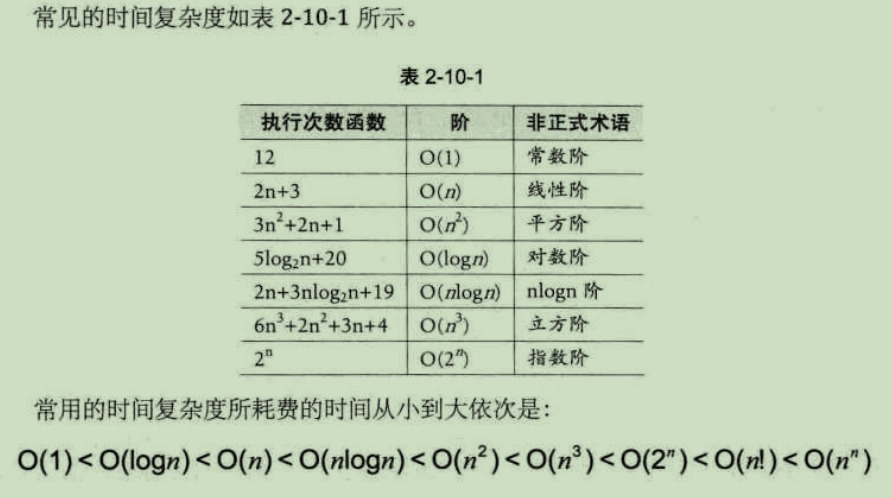

# 知识点

## 算法
### 衡量

---

#### 时间复杂度
*定义*
时间复杂度所需要消耗的时间即基本操作执行次数

*计算*
1.用常数1取代运行时间中国所有的加法常数
2.在修改后的运行次数函数中，只保留最高阶项
3.如果最高阶项存在且不是1，则去除这个项相乘的常数.如下
` O(2n^2) = O(n^2) `


#### 空间复杂度
*定义*
 算法的空间复杂度通过计算算法所需的存储空间实现，即运行完一个程序所需的内存的大小    

***算法的时间复杂度和空间复杂度是可以相互转化的***

*计算*
设一个算法所需的存储空间用f(n)表示
```
空间复杂度的计算公式记作：S(n)=O(f(n))　　
其中n为问题的规模
S(n)表示空间复杂度
```
```
一般情况下，一个程序在机器上执行时：
除了需要存储程序本身的指令，常数，变量和输入数据外
还需要存储对数据操作的存储单元的辅助空间
若输入数据所占空间只取决于问题本身，和算法无关
这样就只需要分析该算法在实现时所需要的辅助单元即可，若算法执行时所需的辅助空间相对于输入数据量而言是个常数，则称此算法为原地工作，空间复杂度为O(1)

```


---


## 线性表
用一段地址连续的存储单元依次存储线性表的数据元
*编号地址*
存储器中的每个存储单元都有自己的编号，这个编号称为地址

### 顺序存储结构

### 链式存储结构
#### 单链表
#### 静态链表
#### 循环链表
#### 双向链表

