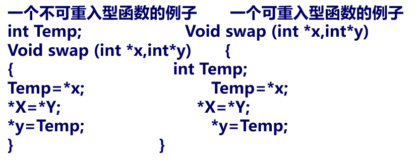

# 嵌入式概述总览
## 概述

### 问答
#### 什么是嵌入式系统
嵌入到应用对象中的专用的计算机系统

#### 为什么要提出嵌入式

#### 嵌入式系统的特点
- 可以裁剪    
- 小而实时
- 专用性 -- 为特定应用定制的计算机系统
- 裁剪性 -- 软、硬件小而精，够用即可
- 实用性 -- 程序和数据都在存储器中，既满足逻辑正确性，也要满足时间正确性
- 可靠性 -- 无人值守。自动化
- 低功耗 -- 便携式应用的要求
- 高性价比 -- 家用的应用要求

对于功能、可靠性、成本、体积、功耗严格要求的专用计算机系统
####  结构
一般由嵌入式微处理器、外围硬件设备、嵌入式操作系统以及用户应用程序等四个部分组成    

#### 从系统的角度定义：
嵌入式系统是设计完成复杂功能的硬件和软件，并使其紧密耦合在一起的计算机系统  
嵌入式反映了：这些系统通常是更大系统中的一个完整的部分，称为嵌入的系统，嵌入的系统重可以共存多个嵌入式系统    

#### 系统架构
- 硬件
- 驱动
- 程序
- 操作系统
- 中间件 -- 第三方设计的函数包，库，层次结构
- 应用程序
 

#### 嵌入式系统编程技巧
1. 时间和空间的效率：更快更省更好
   1. 硬件的致辞：特殊的指令集 thumb-空间效率
   2. 软件的技巧：查表 指针 初始化的提前定义
2. 省电
   1. 时钟的处理：时钟的变频，功能模块的时钟可选择关闭
   2. 操作系统的切换：一个任务等待时另一个任务可以运行，减少无意义的NOP指令的功率耗费
   3. idle任务可以进入CPU的低功耗模式
   4. 事件机制：减少原轮询机制的运行功耗，大部分时间可处于低功耗模式

### 知识点
#### 嵌入式微处理器
32位以上的处理器，在实际嵌入式应用中，只保留与嵌入式应用紧密相关的功能硬件，去除其他的冗余功能部分，这样就以最低的功耗和资源实现嵌入式应用的特殊要求。和工业控制计算机项相比，其体积小，重量轻，成本低，可靠性高的优点
#### 实时系统概念

双规
*实时操作系统*：能够在指定或者确定的时间内完成系统功能以及对外部或内部事件在同步或异步时间内做出响应的系统  

#### 嵌入式系统发展与应用
发展趋势：
1. 嵌入式硬件集成化
2. 嵌入式环境网络化
3. 嵌入式软件构件化
4. 应用模式普适化
5. 行业应用标准化
   

#### 嵌入式系统软硬件IP核
知识产权（IP）电路或核是一种预先设计好的，甚至已经验证过的具有某种确定功能的集成电路、器件或部件。它有行为、结构、物理3种设计，对应的种类是软核、固核和硬核
#### 前后台系统
是中断驱动系统的一种
- 后台是一个轮询系统一直在运行
- 前台是由一些中断处理过程组成的
- 当有一前台事件（外部事件）发生时，引起中断，进行前台处理，处理完成后又回到后台（通常称为主程序）
  
需要考虑的是中断的现场保护和恢复，中断嵌套，中断处理过程与主程序的协调（共享资源）问题

系统的性能主要由中断延迟时间，响应时间和恢复时间来刻画


#### 多任务
多任务运行的实现实际上是靠CPU(中央处理单元)在许多任务之间转换、调度
CPU只有一个，轮番服务于一系列任务中的某一个，多任务运行使CPU的利用率得到最大的发挥，并使应用程序模块化

#### 任务优先级
每个任务都有优先级

#### 调度
地导读是内核的主要职责之一，调度就是决定该轮到哪个人物运行了，多数实时内核是基于优先级调度法的，分为非占先式和占先式两种
#### 非占先式/占先式
- 非占先式：也称为合作型多任务，中断服务可以使一个高优先级的任务由挂起状态变为就绪态，但中断服务以后控制权还是回到原来被中断了的那个任务，直到改任务主动放弃CPU的使用权，那个高优先级的任务才能获得CPU的使用权
  - **一个特点**是不需要信号量保护共享数据，运行着的任务占有CPU
  - **最大缺陷**是响应高优先级的任务慢，内核的响应时间也是不确定的，因为需要等任务执行完
  
- 占先式：最高优先级的任务一旦就绪，总能得到CPU的控制权
  - 当一个运行着的任务使一个比它优先级高的任务进入了就绪态，当前任务的CPU使用权就被剥夺了，或者挂起，高优先级的任务立马得到了CPU的控制权
  - 使用占先式内核时，应用程序应直接使用可重入型函数
  
#### 可重入函数
可以被一个以上的任务调用，而不必担心数据的破坏  
可重入型函数或者只使用局部变量，即局部变量保存在CPU寄存器中或堆栈中



## ARM
### 指令
- 存储器访问指令
- ARM数据处理类指令
- 程序状态寄存器访问指令
- ARMf分支转移类指令
- ARM协处理器类指令
- 软件中断和断点指令 

### ARM体系架构及指令集

#### 指令集

##### 架构
**冯洛伊曼结构**
指令和数据混合存储
**哈佛结构**
指令运算处理上和数据存储上采用并行结构    

**ARM**指令集数据RISC指令，具有RISC指令的特点：
指令少，且等长，标语充分利用流水线技术，使用多寄存器，且多为简单的Load/Store指令（内存取值，执行完再放回内存）

##### ARM和Thumb指令集

**ARM7TDMI**处理器中有两种工作状态：
- ARM - 32 -bit 按字排列的ARM指令集
- Thumb - 16 -bit 按半字排列的Thumb指令集

**切换** 使用BX指令（分支和交换指令）切换指令集状态。 
从ARM状态切换到Thumb状态   
```
LDR R0, = Label +1
BX R0
```
从Thumb状态切换到ARM状态
```
LDR R0, = Label
BX R0
```

**流水线**
流水线技术：几个指令可以并行执行

ARM7系列使用3级流水线，允许多个操作同时处理，比逐条指令执行要快

PC指向正被取指的指令，而非正在执行的指令


#### 大小端模式


- 大端模式
  - 字数据的高位字节存储在低地址中
  - 字数据的低位字节存储在高地址中
- 小端模式
  - 字数据的高位字节存储在高地址中
  - 字数据的低位字节存储在低地址中


### 模式
#### 处理器模式
ARM体系架构支持7种处理器模式，分别为
- 用户模式
- 快中断模式
- 中断模式
- 管理模式
- 中止模式
- 未定义模式
- 系统模式
*上电时候的模式为：管理模式（SVC）*


#### 异常
**异常** 内部或外部中断源产生并引起处理器处理一个事件    
异常类型：

- **FIQ**快速中断请求，CPSR:l = 1
- **IRQ**外部中断请求，CPSR:F = 0 ,系统外设
- 未定义指令：ARM处理器或协处理器遇到不能处理的指令。
- 预取中止
- 数据中止
- 复位
- 软件中断：执行SWI指令产生，可用于用户模式下的程序调用特权操作指令，

##### 说明
1. ARM文档中不严格区分中断和异常，都使用术语exception异常从CPU的角度描述，中断从外部事件的角度描述
2. 异常处理程序的重要性
   设备驱动/中断处理
   操作系统进程调度和切换 
 
### Load-Store指令
解释：从存储器中读某个值，操作完后再将其放回存储器中  

#### CPU如何扩展
数据交换（读/写）采用Load-store指令
由arm来扩展CPU的基本方法是把所有功能部件全部映射成内存，然后每个功能部件的寄存器映射成内存的地址（或一个变量）ARM最大只能对本地的寄存器进行操作，但是它可以通过Load-store指令让它自己的寄存器更功能部件的寄存器进行数据交换，交换完数据进行操作，操作完再交换回去，这样就可以对其他功能部件的数据进行操作了

#### 怎么使用Load-store指令
- 第一部分：把外部功能部件的所有控制寄存器和状态寄存器都映射到RAM空间上统一编址
- 第二部分：ARM通过load或store指令实现内部寄存器和外部映射RAM的空间的数据交换，来达到控制和读取外部功能部件的目的
  


### 指令码及状态字
#### 指令码
**特点** 每条语句都可以有一条键码，每条语句的第二操作数都可以是以为操作数，每条语句都可以有一个状态位


### ARM的初始化

1. 中断向量表
2. 初始化存储器系统
   - 存储器的类型和时序配置
   - 存储器的地址分布
3. 初始化堆栈
   - ARM有7种执行状态，每一种状态堆栈指针寄存器（SP）都是独立的，对每一种模式都要定义SP寄存器的堆栈地址

4. 初始化有特殊要求的端口、设备
5. 初始化应用程序执行环境
   - 完成必要的从ROM到RAM的数据传输
6. 改变处理器模式
7. CALL主程序
   - 系统初始化工作完成后，程序流程转入主应用程序执行
   - 可以直接从启动代码跳到应用程序的主函数入口 


## ucos操作系统

### 相关
#### 高效
- 能做的事情先做（初始化，数据结构）
- 查表操作
- 大量位运算
- ucosii就绪表的三个算法

#### 临界区
代码的临界段也称为临界区，指处理时不可分割的代码


一旦这部分代码开始执行，则不允许任何中断打断，为确保临界区段代码的执行，在进入临界区前需要关中断，而临界区代码执行完以后要立即开中断

### RTOS
实时操作系统：能够在指定或者确定的时间内完成系统功能以及对外部或内部事件在同步或异步时间内做出响应的系统

#### 软实时系统
各个任务运行的 越快越好，不要求限定某一任务必须在多长时间内完成

#### 硬实时系统
各个任务不仅要执行无误而且要做到准时。系统对系统响应时间有严格的以要求，如果系统响应时间不满足，就会引起系统崩溃或致命的错误

#### 硬实时系统


### 一些tips

#### 什么是任务
任务包括：程序体、堆栈（内存区）、TCP（控制块）

#### 任务状态
- DORMANT(睡眠态)
- READY(就绪态)
- RUNNING(运行态)
- WAITING(等待态)
- ISR(中断服务态)


### UCOS内核


### 就绪表


### 任务通信机制


### PV操作
PV操作的信号量是全局的

P:pend 等待

V:post 释放

#### 生产消费问题


# 跳转
[跳转链接list点这里](../list.md)
