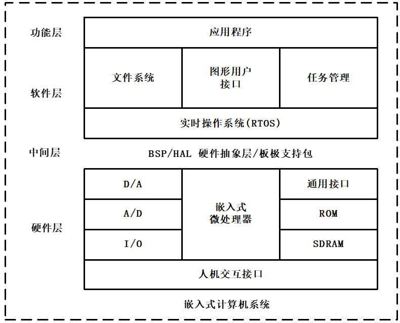
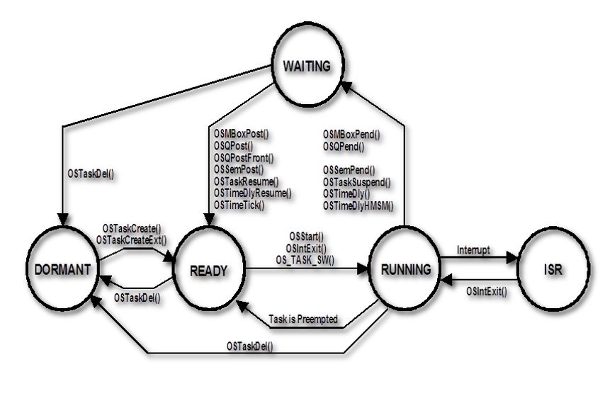

# 嵌入式概述总览
## 概述

### 问答
#### 什么是嵌入式系统
嵌入到应用对象中的专用的计算机系统

#### 为什么要提出嵌入式

#### 嵌入式系统的特点
- 可以裁剪    
- 小而实时
- 专用性 -- 为特定应用定制的计算机系统
- 裁剪性 -- 软、硬件小而精，够用即可
- 实用性 -- 程序和数据都在存储器中，既满足逻辑正确性，也要满足时间正确性
- 可靠性 -- 无人值守。自动化
- 低功耗 -- 便携式应用的要求
- 高性价比 -- 家用的应用要求

对于功能、可靠性、成本、体积、功耗严格要求的专用计算机系统
####  结构
一般由嵌入式微处理器、外围硬件设备、嵌入式操作系统以及用户应用程序等四个部分组成    

#### 从系统的角度定义：
嵌入式系统是设计完成复杂功能的硬件和软件，并使其紧密耦合在一起的计算机系统  
嵌入式反映了：这些系统通常是更大系统中的一个完整的部分，称为嵌入的系统，嵌入的系统重可以共存多个嵌入式系统    

#### 系统架构
- 硬件
- 驱动
- 程序
- 操作系统
- 中间件 -- 第三方设计的函数包，库，层次结构
- 应用程序
 

#### 嵌入式系统编程技巧
1. 时间和空间的效率：更快更省更好
   1. 硬件的致辞：特殊的指令集 thumb-空间效率
   2. 软件的技巧：查表 指针 初始化的提前定义
2. 省电
   1. 时钟的处理：时钟的变频，功能模块的时钟可选择关闭
   2. 操作系统的切换：一个任务等待时另一个任务可以运行，减少无意义的NOP指令的功率耗费
   3. idle任务可以进入CPU的低功耗模式
   4. 事件机制：减少原轮询机制的运行功耗，大部分时间可处于低功耗模式

### 知识点
#### 嵌入式微处理器
32位以上的处理器，在实际嵌入式应用中，只保留与嵌入式应用紧密相关的功能硬件，去除其他的冗余功能部分，这样就以最低的功耗和资源实现嵌入式应用的特殊要求。和工业控制计算机项相比，其体积小，重量轻，成本低，可靠性高的优点
#### 实时系统概念

双规
#### 嵌入式系统软硬件IP核
#### 前后台系统
#### 多任务
#### 任务优先级
#### 调度
#### 非占先式/占先式
#### 可重入函数

## ARM

### ARM体系架构及指令集

### Load-Store指令

#### CPU如何扩展
数据交换（读/写）采用Load-store指令
由arm来扩展CPU的基本方法是把所有功能部件全部映射成内存，然后每个功能部件的寄存器映射成内存的地址（或一个变量）ARM最大只能对本地的寄存器进行操作，但是它可以通过Load-store指令让它自己的寄存器更功能部件的寄存器进行数据交换，交换完数据进行操作，操作完再交换回去，这样就可以对其他功能部件的数据进行操作了

#### 怎么使用Load-store指令
- 第一部分：把外部功能部件的所有控制寄存器和状态寄存器都映射到RAM空间上统一编址
- 第二部分：ARM通过load或store指令实现内部寄存器和外部映射RAM的空间的数据交换，来达到控制和读取外部功能部件的目的
  

## ucos操作系统
### 一些tips

#### 什么是任务
任务包括：程序体、堆栈（内存区）、TCP（控制块）

#### 任务状态
- DORMANT(睡眠态)
- READY(就绪态)
- RUNNING(运行态)
- WAITING(等待态)
- ISR(中断服务态)

### UCOS内核

### 就绪表

### PV操作

