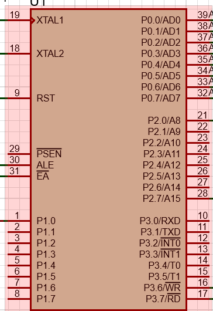
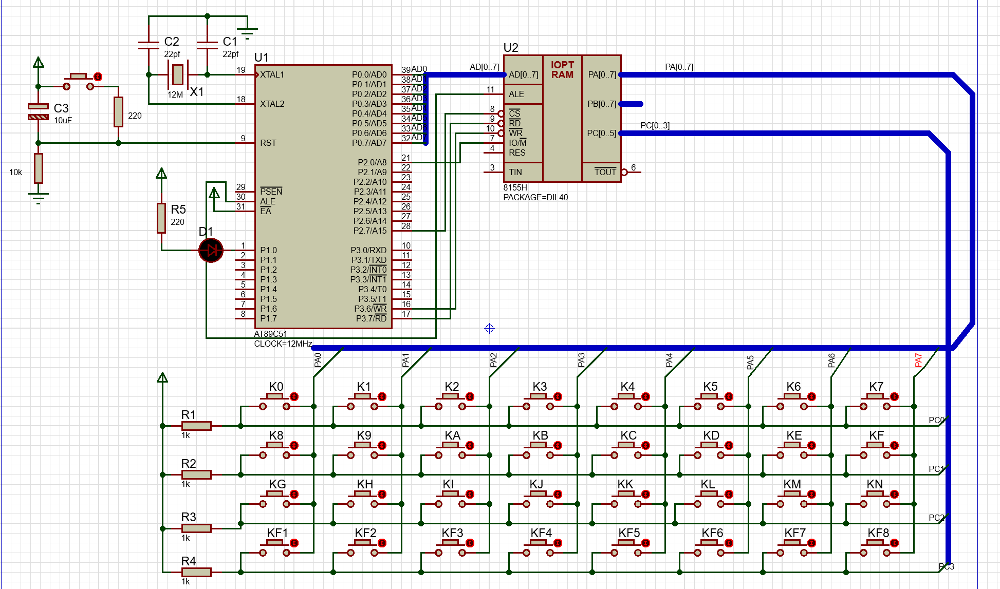
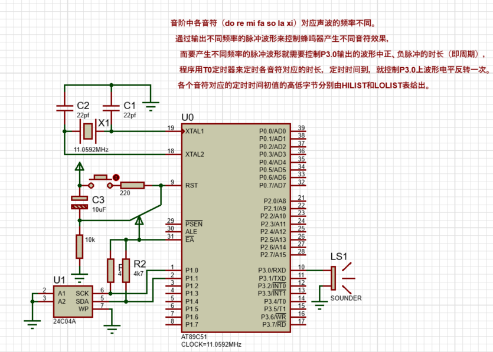
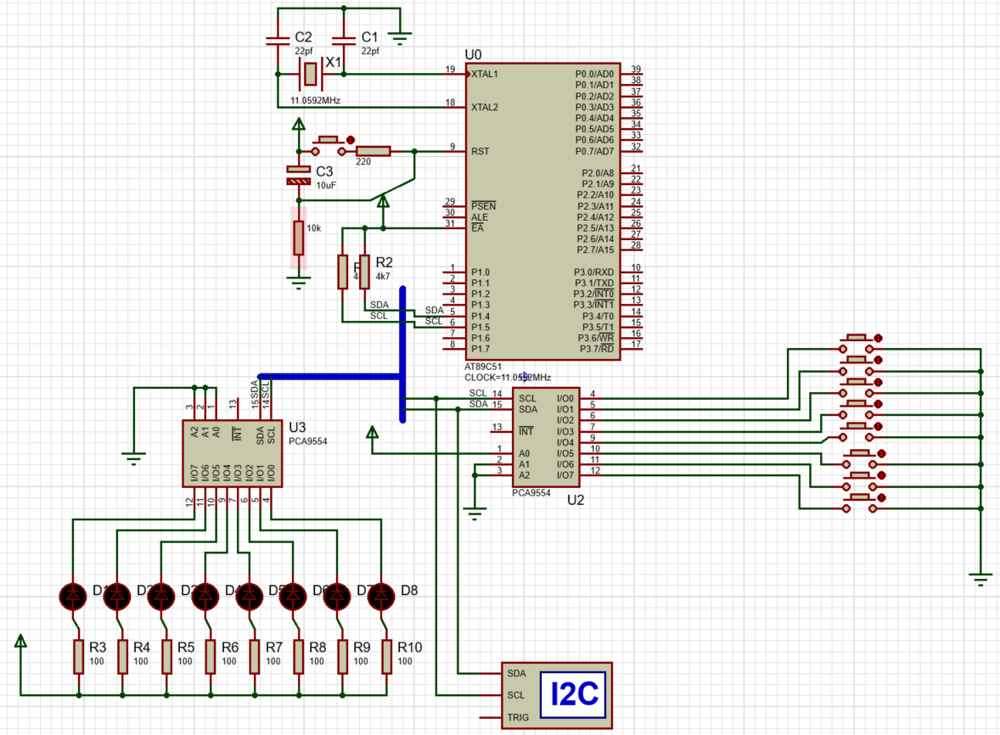
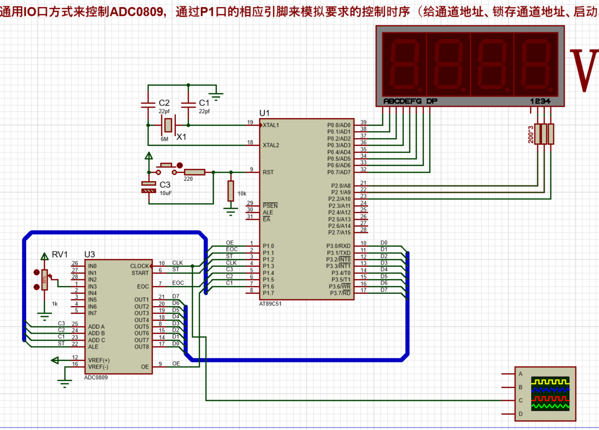
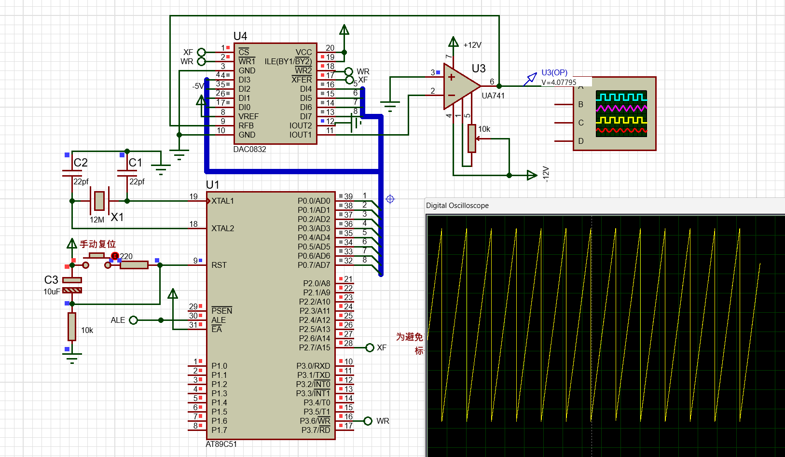
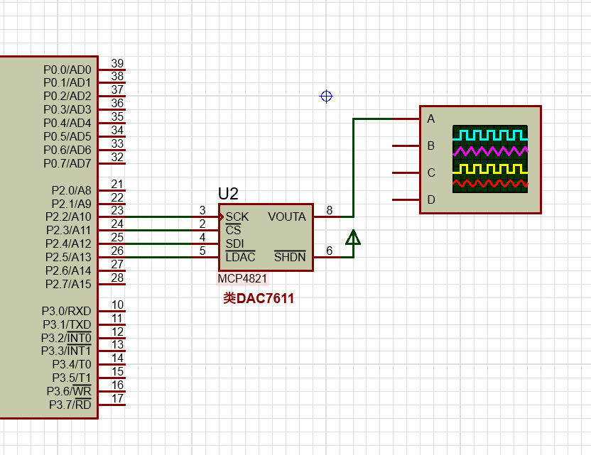
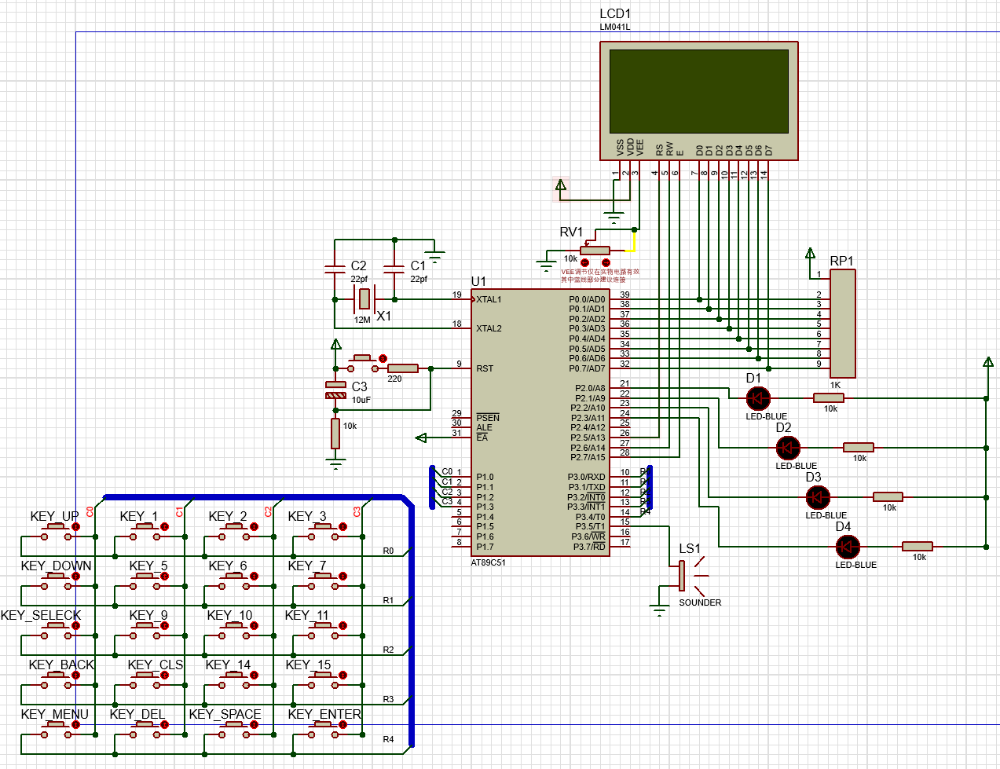
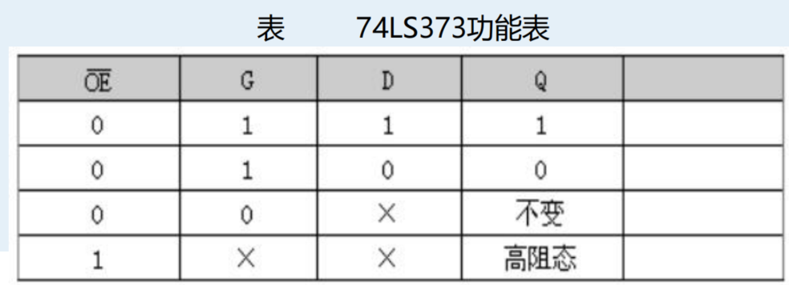

- [常用函数实现](#常用函数实现)
	- [延时函数](#延时函数)
	- [独立按键扫描](#独立按键扫描)
	- [IIC 函数](#iic-函数)
- [51知识](#51知识)
	- [XBYTE](#xbyte)
	- [引脚定义](#引脚定义)
	- [位运算](#位运算)
		- [循环移位的实现](#循环移位的实现)
			- [循环左移(ROL)](#循环左移rol)
			- [循环右移(ROR)](#循环右移ror)
			- [具体实现：](#具体实现)
- [数码管代码](#数码管代码)
- [进制对照表](#进制对照表)
	- [**特殊8位对照表**](#特殊8位对照表)
		- [一位为0，其余为1（7个1 + 1个0）](#一位为0其余为17个1--1个0)
		- [一位为1，其余为0（7个0 + 1个1）](#一位为1其余为07个0--1个1)
- [数码管动态扫描C语言版](#数码管动态扫描c语言版)
- [8155扩展,数码管显示](#8155扩展数码管显示)
	- [C语言代码](#c语言代码)
- [点阵屏幕显示C代码](#点阵屏幕显示c代码)
- [独立连接键盘C代码](#独立连接键盘c代码)
- [矩阵键盘（线反转法）](#矩阵键盘线反转法)
- [8155扩展按键，使用行扫描法](#8155扩展按键使用行扫描法)
- [LCD 1602字符液晶工作代码](#lcd-1602字符液晶工作代码)
- [24C04使用  (IIC)](#24c04使用--iic)
- [PCA9544 使用](#pca9544-使用)
- [ADC0809读取,LCD1602显示显示](#adc0809读取lcd1602显示显示)
	- [IO输入时序](#io输入时序)
	- [定时器输入时序](#定时器输入时序)
- [DAC0832使用  地址扩展](#dac0832使用--地址扩展)
- [DAC7611  SPI](#dac7611--spi)
- [个人代码](#个人代码)
	- [实验一 点阵led显示](#实验一-点阵led显示)
	- [实验一 多段led显示](#实验一-多段led显示)
	- [SPI例程（软件SPI）](#spi例程软件spi)
		- [1. 硬件连接示意图](#1-硬件连接示意图)
		- [2. 完整代码示例](#2-完整代码示例)
		- [3. 关键代码解析](#3-关键代码解析)
			- [(1) SPI时序控制](#1-spi时序控制)
			- [(2) 字节传输逻辑](#2-字节传输逻辑)
		- [4. 扩展功能示例](#4-扩展功能示例)
			- [(1) 写入SPI Flash一页数据](#1-写入spi-flash一页数据)
			- [(2) 读取SPI Flash数据](#2-读取spi-flash数据)
		- [5. 注意事项](#5-注意事项)
		- [6. 硬件SPI扩展（以STC15系列为例）](#6-硬件spi扩展以stc15系列为例)
	- [LCD1604 加 4\*5键盘 加 菜单](#lcd1604-加-45键盘-加-菜单)
- [数字芯片的使用补充](#数字芯片的使用补充)
	- [8-3 译码器](#8-3-译码器)
	- [3-8译码器](#3-8译码器)
	- [地址锁存器](#地址锁存器)

# 常用函数实现

## 延时函数

```c
void delay_ms(INT16U x) 
{
	INT8U t; while(x--) for(t = 0; t < 120; t++);
}
```

## 独立按键扫描

```c
uchar keybd()
{
    P1=0xFF; 
    if(~P1)
    {
    i=(~P1)&0x3F;
    delay_ms(10);						 //去抖动
    if(((~P1)&0x3F)==i)
    switch(i){
        case 0x01:i=0;
                    while(~P1);			 //等待键释放，下同
                    break;
        case 0x02:i=0;while(~P1);break;
        case 0x04:i=1;while(~P1);break;
        case 0x08:i=2;while(~P1);break;
        case 0x10:i=3;while(~P1);break;
        case 0x20:i=4;while(~P1);break;
        case 0x40:i=5;while(~P1);break;
            }
        }
        return i;
}


```

## IIC 函数

```c
//在IIC上产生起始信号
void Start()
{
	SDA=1;
	SCL=1;
	NOP4();		//执行四次NOP（空操作），延时，下同
	SDA=0;
	NOP4();
	SCL=0;
}
//在IIC上产生停止信号
void Stop()
{
	SDA=0;
	SCL=0;
	NOP4();
	SCL=1;
	NOP4();
	SDA=1;
} 
//读取应答
void RACK()
{
	SDA=1;
	NOP4();
	SCL=1;
	NOP4();
	SCL=0;
}
//发送非应答信号
void NO_ACK()
{
	SDA=1;
	SCL=1;
	NOP4();
	SCL=0;
	SDA=0;
}
```

# 51知识

## XBYTE

XBYTE 是Keil C51编译器提供的扩展关键字，属于absacc.h头文件中的宏，用于直接访问8051的外部数据存储器空间（XDATA）。其底层实现为：
> #define XBYTE ((unsigned char volatile xdata *) 0)
作用：将外部存储器的16位地址映射为指针，通过数组形式访问
寻址范围：0x0000~0xFFFF（共64KB）

## 引脚定义

	

## 位运算

以下是 **C语言中常见的位运算** 操作符及其详细用法

---
| **运算符** | **名称**       | **功能**                              | **示例**             |
|------------|----------------|---------------------------------------|----------------------|
| `&`        | 按位与         | 两个位都为1时结果为1                  | `0b1100 & 0b1010 = 0b1000` |
| `\|`       | 按位或         | 任意一位为1时结果为1                  | `0b1100 \| 0b1010 = 0b1110` |
| `^`        | 按位异或       | 两个位不同时结果为1                   | `0b1100 ^ 0b1010 = 0b0110` |
| `~`        | 按位取反       | 所有位取反（0变1，1变0）              | `~0b1100 = 0b0011` (4位) |
| `<<`       | 左移           | 所有位向左移动，低位补0               | `0b0001 << 2 = 0b0100` |
| `>>`       | 右移           | 所有位向右移动（逻辑/算术移位）        | `0b1000 >> 2 = 0b0010` |

---


### 循环移位的实现

#### 循环左移(ROL)
```
原始数据: 1100 1010 (0xCA)
循环左移1位: 
  左移1位: 1001 010? → 1001 010x
  右移7位: 0000 0001 (取最高位)
  合并: 1001 010x | 0000 0001 = 1001 0101 (0x95)
```

#### 循环右移(ROR)
```
原始数据: 1100 1010 (0xCA)
循环右移1位:
  右移1位: ?110 0101 → x110 0101
  左移7位: 0000 000? (取最低位) → 0000 000x
  合并: x110 0101 | 0000 000x = 0110 0101 (0x65)
```
#### 具体实现：

| 数据类型 | 循环左移实现                    | 循环右移实现                    |
|----------|--------------------------------|--------------------------------|
| 8位      | (x<<n)\|(x>>(8-n))           | (x>>n)\|(x<<(8-n))          |
| 16位     | (x<<n)\|(x>>(16-n))          | (x>>n)\|(x<<(16-n))         |
| 32位     | (x<<n)\|(x>>(32-n))          | (x>>n)\|(x<<(32-n))         |
| 64位     | (x<<n)\|(x>>(64-n))          | (x>>n)\|(x<<(64-n))         |

> 提示：所有实现都需要先做 n %= 位数 确保安全移位


# 数码管代码

```c
//共阳数码管0~9的数字段码表
code INT8U SEG_CODE[] = {0xC0,0xF9,0xA4,0xB0,0x99,0x92,0x82,0xF8,0x80,0x90};


//共阴数码管0~9的数字段码表
code INT8U SEG_CODE[] = {0x3f,0x06,0x5b,0x4f,0x66,0x6d,0x7d,0x07,0x7f,0x6f};
```

# 进制对照表

以下是十进制（Dec）、十六进制（Hex）和**4位二进制（Bin）**的完整对照表，覆盖所有16种可能的值（0-15）：

| 十进制 (Dec) | 十六进制 (Hex) | 二进制 (4位 Bin) |
|-------------|---------------|-----------------|
| 0           | 0             | 0000            |
| 1           | 1             | 0001            |
| 2           | 2             | 0010            |
| 3           | 3             | 0011            |
| 4           | 4             | 0100            |
| 5           | 5             | 0101            |
| 6           | 6             | 0110            |
| 7           | 7             | 0111            |
| 8           | 8             | 1000            |
| 9           | 9             | 1001            |
| 10          | A             | 1010            |
| 11          | B             | 1011            |
| 12          | C             | 1100            |
| 13          | D             | 1101            |
| 14          | E             | 1110            |
| 15          | F             | 1111            |

## **特殊8位对照表**


### 一位为0，其余为1（7个1 + 1个0）
| 0的位置 | 二进制      | 十六进制 | 十进制 |
|---------|------------|----------|--------|
| 位7 (MSB) | 01111111 | 0x7F   | 127    |
| 位6     | 10111111 | 0xBF   | 191    |
| 位5     | 11011111 | 0xDF   | 223    |
| 位4     | 11101111 | 0xEF   | 239    |
| 位3     | 11110111 | 0xF7   | 247    |
| 位2     | 11111011 | 0xFB   | 251    |
| 位1     | 11111101 | 0xFD   | 253    |
| 位0 (LSB) | 11111110 | 0xFE   | 254    |

### 一位为1，其余为0（7个0 + 1个1）
| 1的位置 | 二进制      | 十六进制 | 十进制 |
|---------|------------|----------|--------|
| 位7 (MSB) | 10000000 | 0x80   | 128    |
| 位6     | 01000000 | 0x40   | 64     |
| 位5     | 00100000 | 0x20   | 32     |
| 位4     | 00010000 | 0x10   | 16     |
| 位3     | 00001000 | 0x08  | 8      |
| 位2     | 00000100 | 0x04  | 4      |
| 位1     | 00000010 | 0x02   | 2      |
| 位0 (LSB) | 00000001 | 0x01   | 1      |


# 数码管动态扫描C语言版

动态扫描原理图：


```
void main()
{
	INT8U i;  
	array[3]=1;
	while (1)
	{
	   for ( i=0; i<8; i++ ) //扫描显示8位数码管
	   { P0= 0xff;		//段码口输出全1，即先关闭
	     P2=1 << i;		
		 //输出位选码 00000001 00000010 00000100 .... 10000000
		 //类似于循环移位
		 P0=SEG_CODE[array[i]];	 //输出段选码
		 delay_ms(4);	   
	   }  					 
	}
}
```

# 8155扩展,数码管显示

原理图如下：


## C语言代码
```c
#include<reg52.h>
#include<absacc.h>
#include <intrins.h>
#define uchar unsigned char
#define uint unsigned int
#define dula_data XBYTE[0x7f02]	  //8155 PB口地址 
#define wela_data XBYTE[0x7f01]	  //8155 PA口地址
#define dispcom XBYTE[0x7f00]	  //8155命令寄存器地址
uchar code table[]={
0x3f,0x06,0x5b,0x4f,
0x66,0x6d,0x7d,0x07,
0x7f,0x6f,0x77,0x7c,
0x39,0x5e,0x79,0x71,
0x76,0x38};
void delay(uint x)
{
	uint i,j;
	for(i=x;i>0;i--)
		for(j=11;j>0;j--) ;
}
void main()
{                   
    dispcom=0x03;
    //使用8155前别忘了应先对其初始化,
    //设置其口的工作方式、输出输入方向！
    //这里设置PA口，PB口为基本输出方式，为输出口。   
    while(1)	    			 
   {
    wela_data=0x20;
    dula_data=table[5];
		delay(5);

    wela_data=0x10;
    dula_data=table[4];
		delay(5);
    wela_data=0x08;
    dula_data=table[3];
		delay(5);
    wela_data=0x04;
    dula_data=table[2];
		delay(5);
    wela_data=0x02;
    dula_data=table[1];
		delay(5);
    wela_data=0x01;
    dula_data=table[0];
		delay(5);      
    }
}
```

# 点阵屏幕显示C代码

原理图如下：


```c
//  名称: TIMER0控制8×8LED点阵屏显示数字
#include <reg51.h>
#include <intrins.h>
#define INT8U   unsigned char
#define INT16U  unsigned int
//-----------------------------------------------------------------
// 数字点阵
//-----------------------------------------------------------------
INT8U code DotMatrix[] = 
{	0x00,0x3E,0x41,0x41,0x41,0x3E,0x00,0x00,	//0	的点阵码
	0x00,0x00,0x00,0x21,0x7F,0x01,0x00,0x00,	//1	的点阵码
	0x00,0x27,0x45,0x45,0x45,0x39,0x00,0x00,	//2	的点阵码
	0x00,0x22,0x49,0x49,0x49,0x36,0x00,0x00,	//3	的点阵码
	0x00,0x0C,0x14,0x24,0x7F,0x04,0x00,0x00,	//4	的点阵码
	0x00,0x72,0x51,0x51,0x51,0x4E,0x00,0x00,	//5	的点阵码
	0x00,0x3E,0x49,0x49,0x49,0x26,0x00,0x00,	//6	的点阵码
	0x00,0x40,0x40,0x40,0x4F,0x70,0x00,0x00,	//7	的点阵码
	0x00,0x36,0x49,0x49,0x49,0x36,0x00,0x00,	//8	的点阵码
	0x00,0x32,0x49,0x49,0x49,0x3E,0x00,0x00		//9	的点阵码
};
INT8U i=0,t=0,Num_Index,cs; 

//------------------------------------------------------------------
// 主程序
//------------------------------------------------------------------
void main() 
{  
 //P3=0x80;       //列选码初值1000000B，经左移1位，根据连线图可知最先选C0列
  cs=0x80;
 Num_Index=0;    //从“0 ”开始显示 
 TMOD=0x00;      //T0 工作在方式 0 、作13位的定时器
 TH0=(8192-2000)/32;   //求定时 2ms的初值，高8位放TH0,
 TL0=(8192-2000)%32;  //初值低5位放TL0 （2^13=8192，2^5=32）
 IE=0x82;    //开T0中断和总中断
 TR0=1;      //启动 T0 
 while(1);    //无限循环，(每当定时时间到，则执行中断函数一次)
} 

//------------------------------------------------------------------
// T0定时器溢出中断函数控制LED点阵屏刷新显示
//------------------------------------------------------------------
void LED_Screen_Refresh() interrupt 1 
{
    TH0=(8192-2000)/32;      //重置初值 
    TL0=(8192-2000)%32; 

//	P2=0xff;        //输出点阵码 
    P3=0x00;
	P2=~DotMatrix[Num_Index*8+i]; //因LED是共阳极故取反
    cs=_crol_(cs,1);
	P3=cs;
   //P3=_crol_(P3,1);  //P3值循环左移1位，调整列选码并输出
   if(++i==8) i=0;   //每个数字的点阵码有 8 个字节 
   if(++t==250)    //每个数字刷新显示一段时间(执行该函数250次
                     //即约250×2ms后调整指针Num_Index显示下一个 
 { 
    t=0; 
    if(++Num_Index==10) Num_Index=0; //偏移量加1，显示
             //下一个数字,若偏移量加1后=10，则重置为从0开始 
 } 


```

# 独立连接键盘C代码

```c
#include <reg52.h>
#define uchar	unsigned char
#define uint	unsigned int
//0~9的共阴数码管段码表
code uchar SEG_CODE[] = { 0x3F,0x06,0x5B,0x4F,0x66,0x6D,0x7D,0x07,0x7F,0x6F,0x40};
uchar keybd();
uchar i=10;			             //初始显示短横线
void delay_ms(uchar x) {
	uchar t; while(x--) for(t = 0; t < 120; t++);
}
  
void main()
{  						 
   while(1){
	P2=	 SEG_CODE[keybd()]	;
	}
}
uchar keybd()
{
	P1=0xFF; 
	if(~P1)
	{
	i=(~P1)&0x3F;
	delay_ms(10);						 //去抖动
	if(((~P1)&0x3F)==i)
	switch(i){
		case 0x01:i=0;
					while(~P1);			 //等待键释放，下同
					break;
		case 0x02:i=1;while(~P1);break;
		case 0x04:i=2;while(~P1);break;
		case 0x08:i=3;while(~P1);break;
		case 0x10:i=4;while(~P1);break;
		case 0x20:i=5;while(~P1);break;
			}
		}
		return i;
}

```

# 矩阵键盘（线反转法）

原理图：


```c
//-----------------------------------------------------------------
//	名称: 数码管显示4×4 键盘矩阵按键值
//-----------------------------------------------------------------
//	说明: 按下任意一按键时,数码管会显示它在键盘矩阵上的序号0 - F,
//			 采用的是线反转法
//		扫描程序首先判断按键发生在哪一列,然后根据所发生的行附加
//		不同的值,从而得到键盘按键值.
//			
//-----------------------------------------------------------------
#include <reg51.h>
#define INT8U	unsigned char
#define INT16U unsigned int
//0~F的共阳数码管段码,最后一个是黑屏
const INT8U SEG_CODE[] =
{ 0xC0,0xF9,0xA4,0xB0,0x99,0x92,0x82,0xF8,
  0x80,0x90,0x88,0x83,0xC6,0xA1,0x86,0x8E,0xFF
};

sbit BEEP = P3^0; 
//当前按键值,该矩阵中键值范围为0-15,0xFF表示无按键
INT8U  keyNo = 0xff;

//-----------------------------------------------------------------
// 延时函数
//-----------------------------------------------------------------
void delay_ms(INT16U x)
{
	INT8U t; while(x--) for(t = 0; t < 120; t++);
}

//-----------------------------------------------------------------
// 键盘矩阵扫描子程序
//-----------------------------------------------------------------
void Keys_Scan()
{ 
	//高四位置零， 放入四行， 扫描四列
	P1 = 0x0f;
	delay_ms(1);
	if (P1 == 0x0f)
	{
		keyNo = 0xff;
		return;    //无按键提前返回
	}

	//按键后00001111将变成0000xxxx,x中一个为0，三个为1
	//下面判断按键发生于0~3列的那一列
	switch (P1)
	{
		case 0x0e: keyNo = 0; break;      //按键在第0列 
		case 0x0d: keyNo = 1; break;      //按键在第1列
		case 0x0b: keyNo = 2; break;      //按键在第2列
		case 0x07: keyNo = 3; break;      //按键在第3列
		default:   keyNo = 0xff;  return ;  //无按键返回
	}

	//第四位置零，放入四列，扫描四行
	P1 = 0xf0;
	delay_ms(1);
	//按键后11110000将变成xxxx0000，x中一个为0，三个为1
	//下面判断按键发生于0~3行中的哪一行
	//对于0~3分别附加初值：0，4，8，12
	switch(P1)
	{
		case 0xe0: keyNo += 0; break;      //按键在第0行 
		case 0xd0: keyNo += 4; break;      //按键在第1行
		case 0xb0: keyNo += 8; break;      //按键在第2行
		case 0x70: keyNo += 12; break;     //按键在第3行
		default:   keyNo = 0xff;
		
	}

		
}

//-----------------------------------------------------------------
// 蜂鸣器子程序
//-----------------------------------------------------------------
void Beep()
{
	INT8U i;
	for (i = 0; i < 60; i++)
	{
		delay_ms(1);
		BEEP = ~BEEP;
	}
	BEEP = 1;

	
}

//-----------------------------------------------------------------
// 主程序
//-----------------------------------------------------------------
void main()
{	INT8U  keyNo_temp;   //在等待键释放前，先把键值暂存在这
	P0 = 0xff;      //数码管初始值黑屏
	while(1)
	{
		Keys_Scan();     //扫描键盘获取键号
	
		if(keyNo == 0xff)	//当无按键时，延时10ms
		{
			delay_ms(10);
			continue;	   // 无按键时延时10ms，然后退出这次循环，跳到循环体开头，继续新的一次扫描按键
		}
		                   // 有按键则继续执行这下面的程序段
		keyNo_temp= keyNo;	//在等待键释放前，先把键值暂存在这
		while( Keys_Scan(),  keyNo != 0xff);	  //未释放,等待
		//显示键值并蜂鸣
		P0 = SEG_CODE[keyNo_temp];		 // 思考，这里为什么不是用P0 = SEG_CODE[keyNo] ？
		Beep();
		
	}

}
```

# 8155扩展按键，使用行扫描法

	

```c
#include<reg52.h>
#include<absacc.h>
#include <intrins.h>
#define uchar unsigned char
#define uint unsigned int
#define dula_data XBYTE[0x7f02]  //8155 PB口地址 
#define scan_data XBYTE[0x7f01]	  //8155 PA口地址  扫描口
#define read_data XBYTE[0x7f03]	  //8155 PC口地址  回扫口
#define dispcom XBYTE[0x7f00]	  //8155命令寄存器地址
sbit LED = P1^0;
uchar code table[]={
0x3f,0x06,0x5b,0x4f,
0x66,0x6d,0x7d,0x07,
0x7f,0x6f,0x77,0x7c,
0x39,0x5e,0x79,0x71,
0x76,0x38};		  
uchar keyNo = 0xff;
void key8155();
void delay_ms(uint x)
{
	uchar t;
	while(x--) for(t = 0; t < 120; t++);
}
//--------------------主程序------------------------------------------------------------------------------------------------
void main()
{   uchar keyNo_temp =0xff;                
    dispcom=0x01;              // 使用8155前应先对其初始化设置其口的工作方式、输出输入方向！A口基本输出方式，C口为输入方式   
	while(1)	    			  
	{	key8155();
	    if(keyNo==0xff) {delay_ms(10);continue;}
		keyNo_temp= keyNo;						 //有按键	 
		while(key8155(), keyNo!= 0xff);			 // 等键释放 
		LED = ~LED; 							 
		DBYTE[0x70]= keyNo_temp;    			 
	}
}
//---------------------键盘接口子程序----------------------------------------------------------------------------------------
/* 8155键盘扫描函数（8x4矩阵键盘）*/
void key8155()
{    
    uchar i;  // 循环计数器
    
    // 第一次预扫描（检测是否有按键按下）
    scan_data = 0x00;     // 所有行线置低电平（准备检测列线）
    delay_ms(1);          // 稳定信号
    if (((~read_data)&0x0f) == 0x00)  // 读取列线并取反，检查低4位
    {
        keyNo = 0xff;     // 无按键按下（0xFF表示无效键值）
        return;           // 提前返回
    }
    
    // 延时去抖动（10ms是典型机械按键消抖时间）
    delay_ms(10);          
    
    // 第二次确认扫描（防抖验证）
    scan_data = 0x00;     // 再次置低所有行线
    delay_ms(1);
    if (((~read_data)&0x0f) == 0x00)  // 再次检查列线
    {
        keyNo = 0xff;     // 确认无按键
        return;           // 提前返回
    }
    
    // 逐行扫描（共8行）
    for(i=0; i<8; i++)
    {   
        scan_data = ~(1 << i);  // 当前行置低（其他行高电平），例如i=0时输出11111110
        delay_ms(1);           // 稳定信号
        
        // 读取列线状态（低4位有效）
        switch((~read_data)&0x0f)
        {
            case 0x01:          // 第1列有按键
                keyNo = 0 + i;  // 键值 = 基值（0/8/16/24） + 行号
                return;        // 立即返回（优先处理第一个检测到的按键）
                
            case 0x02:          // 第2列
                keyNo = 8 + i;
                return;
                
            case 0x04:          // 第3列
                keyNo = 16 + i;
                return;
                
            case 0x08:          // 第4列
                keyNo = 24 + i;
                return; 
                
            case 0x00:          // 当前行无按键
                break;         // 继续扫描下一行
        }
    }
    
    // 扫描完成但未检测到有效按键（理论上不会执行到这里，因为前两次检测已过滤）
    keyNo = 0xff;  // 设置为无效键值
    return; 
}


```
# LCD 1602字符液晶工作代码

```c
#include <reg51.h>
#define uchar unsigned char 
#define uint unsigned int
uchar code table1[]="I LOVE MCU!";        //第一行显示的字符,共11个
uchar code table2[]="WWW.YNMEC.COM";      //第二行显示的字符，共13个
sbit RS=P2^5;          //单片机端口定义
sbit RW=P2^6;
sbit E=P2^7;
uchar num;
void delay(uint xms)      //----------延时子函数--------------------
{
	uint i,j;
	for(i=xms;i>0;i--)
		for(j=125;j>0;j--);
}

void write_com(uchar com)     //---------写命令子函数------------
{	RS=0;        //写命令
	RW=0;       //写模式
    P0=com;     //将命令字送到数据线上
	delay(5);     //稍延时
    E=1;  //给E一个高脉冲将命令字送入液晶控制器，完成写操作
	delay(5);
	E=0;
}
void write_data(uchar date)  //---------写数据子函数---------------
{	RS=1;             //写数据
	RW=0;            // 写模式
	P0 = date;       //将要写的数据送到数据线上
	delay(5);        //稍延时
     E=1;   //给E一个高脉冲将命令字送入液晶控制器，完成写操作
	delay(5);
	E=0;
}
void LCD1602_init()      //--------------LCD1602初始化设置------------
{
	E=0;
    write_com(0x38);      //设置8位数据接口，16×2显示，5×7点阵
    write_com(0x0c);      //设置开显示，光标不显示
    write_com(0x06);      //写一个字符后地址指针自动加上
    write_com(0x01);      //清屏，数据指针清0
}

//---------------------主函数-----------------------------------------
void main()
{	LCD1602_init();
	write_com(0x80);      //DDRAM数据指针定位在第一行第一个字符处
	for(num=0;num<11;num++)  //写第一行要显示的信息
	{	write_data(table1[num]);
		delay(5);     //每两个字符间稍延时
	}
	write_com(0x80+0x40); // 数据指针定位在第二行首字符处
	for(num=0;num<13;num++)   //写第二行要显示的信息
	{
		write_data(table2[num]);
	           delay(5);
	}
	while(1);
}

```

# 24C04使用  (IIC)

原理图：	
	
```c
#include<reg51.h>
#include<intrins.h>
#define uchar unsigned char
#define uint unsigned int
#define NOP4() {_nop_();_nop_();_nop_();_nop_();}
sbit SCL=P1^0;
sbit SDA=P1^1;
sbit SPK=P3^0;					//蜂鸣器输出端
//标准音阶频率对应的定时初值表		 按照1234567和高音的1234567存放，共14个音符，即数组第0~6对应音符1234567，第7~13对应高音音符1234567.
uchar code HI_LIST[]={226,229,232,233,236,238,240,241,242,244,245,246,247,248}; //依次对应1234567和高音的1234567的T0高位定时初值
uchar code LO_LIST[]={4,13,10,20,3,8,6,2,23,5,26,1,4,3};   //依次对应1234567和高音的1234567的T0低位定时初值
//待写入24C04的音符
uchar code Song_24C04[]={0,1,2,0,0,1,2,0,2,3,4,4,2,3,4,4};//1234567音符分别对应上面数组的0123456位置，所以要把简谱里的音符号要减1后存入
//uchar code Song2_24C04[]={0,0,4,4,5,5,4,4,3,3,2,2,1,1,0,0,4,4,3,3,2,2,1,1,4,4,3,3,2,2,1,1,0,0,4,4,5,5,4,4,3,3,2,2,1,1,0,0};//小星星
uchar sidx;			//读取音符索引
//延时
void DelayMS(uint ms)
{
	uchar i;
	while(ms--) for(i=0;i<120;i++);
}
//在IIC上产生起始信号
void Start()
{
	SDA=1;
	SCL=1;
	NOP4();		//执行四次NOP（空操作），延时，下同
	SDA=0;
	NOP4();
	SCL=0;
}
//在IIC上产生停止信号
void Stop()
{
	SDA=0;
	SCL=0;
	NOP4();
	SCL=1;
	NOP4();
	SDA=1;
} 
//读取应答
void RACK()
{
	SDA=1;
	NOP4();
	SCL=1;
	NOP4();
	SCL=0;
}
//发送非应答信号
void NO_ACK()
{
	SDA=1;
	SCL=1;
	NOP4();
	SCL=0;
	SDA=0;
}
//向24C04中写一个字节数据
void Write_A_Byte(uchar b)
{
	uchar i;
	for(i=0;i<8;i++)
	{
		b<<=1;	    //将要传输的字节左移一位,最高一位移到了进位位C中，（CY就是表示进位位c）
		SDA=CY;
		_nop_();
		SCL=1;
		NOP4();
		SCL=0;
	}
	RACK();			//接收从机的应答信号
}
//向指定地址写数据
void Write_IIC(uchar addr,uchar dat)
{
	Start();
	Write_A_Byte(0xa0);
	Write_A_Byte(addr);
	Write_A_Byte(dat);
	Stop();
	DelayMS(10);
}
//从24C04中读一个字节数据
uchar Read_A_Byte()
{
	uchar i,b;  
	for(i=0;i<8;i++)
	{
		SCL=1;
		b<<=1;		  //当前b左移1位————各位往高位移1位，最低位变为0
		b|=SDA;		  //b的最低位与SDA线上的值相“或”，“或”后结果放b的最低位	,就等价于将读取到的当前位数据放进b中最低位（之后经多次移位，移到对应的数据位上）
		SCL=0;
	}
	return b;		  //返回值b中内容就是读到的一个字节
}
//从当前地址读取数据
uchar Read_Current()
{
	uchar d;
	Start();
	Write_A_Byte(0xa1);
	d=Read_A_Byte();  //读取到的字节数据放d中
	NO_ACK();
	Stop();
	return d;
}
//从任意地址读取数据
uchar Random_Read(uchar addr)
{
	Start();
	Write_A_Byte(0xa0);
	Write_A_Byte(addr);
	Stop();
	return Read_Current();
}
//定时器0中断
void T0_INT() interrupt 1
{
	SPK=~SPK;    	   // P3.0电平反转一次
	TH0=HI_LIST[sidx];
	TL0=LO_LIST[sidx];
}
//主程序
void main()
{
	uint i;
	IE=0x82;
	TMOD=0x00;					   //设置定时器 T0为13位定时器
	for(i=0;i<16;i++)			   //将存放在Song_24C04[]的乐谱写入24C04。其实实际上该写入步骤并不是在主函数执行。实际应是预先将多首歌曲乐谱存入24C04，掉电不会丢失，
	                               //而单片机在程序中只需要对24c04进行读操作，依次取出并播放
	{
		Write_IIC(i,Song_24C04[i]);
	} 

/*		for(i=0;i<48;i++)		   //将存放在Song2_24C04[]的乐谱写入24C04。其实实际上该写入步骤并不是在主函数执行。实际应是预先将多首歌曲乐谱存入24C04，掉电不会丢失，
	                               //而单片机在程序中只需要对24c04进行读操作，依次取出并播放
	{
		Write_IIC(i,Song2_24C04[i]);	 
	}								 */

	while(1)			 			//读取一个音符并播放，重复16次
	{
    	for(i=0;i<16;i++)			//从24C04中读取第1首
	/*	   	for(i=0;i<48;i++)			//从24C04中读取第2首   */
		{
			sidx=Random_Read(i);	//从指定地址读取
			TH0=HI_LIST[sidx];
	        TL0=LO_LIST[sidx];
			TR0=1;					//启动定时器，让播放
			DelayMS(350);			//该延时控制每个音符播放的时长，该延时短则体现出乐曲节拍快，反之节拍慢
		}
	}
}


```

# PCA9544 使用
原理图：
	

```c
#include<reg51.h>
#include<intrins.h>
#define uchar unsigned char
#define uint unsigned int
#define NOP4() {_nop_();_nop_();_nop_();_nop_();}
sbit SCL=P0^0;
sbit SDA=P0^1;
#define PCA9554_LED 0x40
#define PCA9554_KEY 0x42
uchar buffer1[1];
uchar buffer2[1];
//延时
void DelayMS(uint ms)
{
	uchar i;
	while(ms--) for(i=0;i<120;i++);
}
//在IIC上产生起始信号
void Start()
{
	SDA=1;
	SCL=1;
	NOP4();		//执行四次NOP（空操作），延时，下同
	SDA=0;
	NOP4();
	SCL=0;
}
//在IIC上产生停止信号
void Stop()
{
	SDA=0;
	SCL=0;
	NOP4();
	SCL=1;
	NOP4();
	SDA=1;
} 
//读取应答
void RACK()
{
	SDA=1;
	NOP4();
	SCL=1;
	NOP4();
	SCL=0;
}
//发送非应答信号
void NO_ACK()
{
	SDA=1;
	SCL=1;
	NOP4();
	SCL=0;
	SDA=0;
}
//向24C04中写一个字节数据
void Write_A_Byte(uchar b)
{
	uchar i;
	for(i=0;i<8;i++)
	{
		b<<=1;	    //将要传输的字节左移一位,最高一位移到了进位位C中，（CY就是表示进位位c）
		SDA=CY;
		_nop_();
		SCL=1;
		NOP4();
		SCL=0;
	}
	RACK();			//接收从机的应答信号
}
//向指定地址写数据
void Write_IIC(uchar addr,uchar dat)
{
	Start();
	Write_A_Byte(0xa0);
	Write_A_Byte(addr);
	Write_A_Byte(dat);
	Stop();
	DelayMS(10);
}
//从中读一个字节数据
uchar Read_A_Byte()
{
	uchar i,b;  
	for(i=0;i<8;i++)
	{
		SCL=1;
		b<<=1;		  //当前b左移1位————各位往高位移1位，最低位变为0
		b|=SDA;		  //b的最低位与SDA线上的值相“或”，“或”后结果放b的最低位	,就等价于将读取到的当前位数据放进b中最低位（之后经多次移位，移到对应的数据位上）
		SCL=0;
	}
	return b;		  //返回值b中内容就是读到的一个字节
}
//从当前地址读取数据
uchar Read_Current()
{
	uchar d;
	Start();
	Write_A_Byte(0xa1);
	d=Read_A_Byte();  //读取到的字节数据放d中
	NO_ACK();
	Stop();
	return d;
}
//从任意地址读取数据
uchar Random_Read(uchar addr)
{
	Start();
	Write_A_Byte(0xa0);
	Write_A_Byte(addr);
	Stop();
	return Read_Current();
}
/* I2C发送字符串函数（实际发送单字节数据）
 * 参数说明：
 *   sla: 从设备地址（7位地址，不含R/W位）
 *   suba: 子地址/寄存器地址
 *   s: 指向包含1个字节数据的数组的指针
 */
void ISendStr(uchar sla, uchar suba, uchar (*s)[1])
{
    Start();                // 发送I2C起始信号
    Write_A_Byte(sla);      // 发送从设备地址（写模式，sla左移1位后最低位为0）
    Write_A_Byte(suba);     // 发送子地址/寄存器地址
    Write_A_Byte((*s)[0]);  // 发送数据字节
    Stop();                 // 发送I2C停止信号
    DelayMS(10);            // 延时10ms（确保设备处理完成）
}

/* I2C接收字符串函数（实际接收单字节数据）
 * 参数说明：
 *   sla: 从设备地址（7位地址）
 *   suba: 子地址/寄存器地址
 *   s: 指向存储接收数据的数组的指针
 */
void IRcvStr(uchar sla, uchar suba, uchar (*s)[1])
{
    // 注释掉的原始实现（非常规I2C读取流程）
    // Start();
    // Write_A_Byte(sla);      // 发送从设备地址（写模式）
    // Write_A_Byte(suba);     // 发送子地址
    // Write_A_Byte(0x43);     // 异常操作（不应在此写入数据）
    // (*s)[0] = Read_A_Byte();// 读取数据
    // Stop();
    // DelayMS(10);

    // 修正后的实现（更符合I2C标准读取流程）
    Write_IIC(sla, suba);   // 先写入目标地址（可能包含内部函数）
    Start();                // 发送重复起始条件（Repeated Start）
    Write_A_Byte(0x43);     // 发送从设备地址+读位（0x43 = sla<<1 | 0x01）
    (*s)[0] = Read_A_Byte();// 读取数据字节
    Stop();                 // 发送停止信号
    DelayMS(10);            // 延时10ms
}

/* 主函数 */
void main()
{
    // 初始化PCA9554 LED控制器
    buffer1[0] = 0x00;
    ISendStr(PCA9554_LED, 0x03, &buffer1); // 配置寄存器0x03（方向寄存器，0=输出）
    
    buffer1[0] = 0xff;
    ISendStr(PCA9554_LED, 0x01, &buffer1); // 向输出寄存器0x01写入0xFF（LED全灭）

    // 主循环
    while(1)
    {
        // 读取PCA9554按键状态（从寄存器0x00）
        IRcvStr(PCA9554_KEY, 0x00, &buffer2);
        
        // 将按键状态直接输出到LED（寄存器0x01）
        ISendStr(PCA9554_LED, 0x01, &buffer2);
        
        // 效果：按键按下时对应LED亮起（需硬件支持低电平点亮LED）
    }
}


```

# ADC0809读取,LCD1602显示显示

## IO输入时序
原理图：	
		
```c
#include <reg51.h>       // 8051标准头文件
#include <intrins.h>     // 内联函数库（包含_nop_()）
#define uchar unsigned char  // 定义无符号字符类型简写
#define uint unsigned int    // 定义无符号整型简写
#define NOP4() {_nop_();_nop_();_nop_();_nop_();}  // 4个空指令延时宏

// I2C通信引脚定义（用于PCA9554通信）
sbit SCL = P0^0;  // I2C时钟线
sbit SDA = P0^1;  // I2C数据线

// PCA9554器件地址定义（用于LCD数据线控制）
#define PCA9554_LCD 0x40  // 器件地址：A0A1A2=000（二进制01000000）

// ADC0809引脚定义
sbit OE  = P1^0;    // 输出使能（高电平有效）
<!-- @import "[TOC]" {cmd="toc" depthFrom=1 depthTo=6 orderedList=false} -->

sbit EOC = P1^1;    // 转换结束标志（低电平表示转换中）
sbit ST  = P1^2;    // 启动转换信号（上升沿触发）
sbit CLK = P1^3;    // 时钟输入（典型频率500kHz）

// LCD1602控制引脚定义
sbit RS = P2^0;     // 寄存器选择（0=指令寄存器，1=数据寄存器）
sbit RW = P2^1;     // 读写控制（0=写，1=读）
sbit E  = P2^2;     // 使能信号（下降沿执行命令）

// 全局变量
uchar adc_raw;       // 存储ADC原始值（0-255）

// 通道3选择参数（对应ADC0809的IN3通道）
const uchar channel_three[3] = {0, 0, 1};  // 二进制011选择IN3

// 函数声明
void DelayMS(uint ms);                // 毫秒级延时
void I2C_Start();                     // I2C起始信号
void I2C_Stop();                      // I2C停止信号
void I2C_SendByte(uchar dat);         // I2C发送单字节
void PCA9554_Write(uchar addr, uchar reg, uchar dat); // PCA9554写操作
void ADC_Init();                      // ADC初始化
uchar ADC_Read();                     // ADC读取数据
void LCD_Init();                      // LCD初始化
void LCD_Cmd(uchar cmd);              // 发送LCD指令
void LCD_Data(uchar dat);             // 发送LCD数据
void Timer0_Init();                   // 定时器0初始化（用于ADC时钟）
void Display_Voltage(uint voltage);   // 电压显示函数

// 定时器0中断服务函数（为ADC0809提供时钟）
void Timer0_ISR() interrupt 1 {  // 中断号1对应定时器0
    CLK = !CLK;  // 翻转时钟信号（产生方波）
}

// 主函数
void main() {
    uint voltage;  // 存储计算后的电压值（单位：mV）
  
    Timer0_Init();  // 初始化定时器（用于ADC时钟）
    ADC_Init();     // 初始化ADC0809
    PCA9554_Write(PCA9554_LCD, 0x03, 0x00); // 配置PCA9554的PORT0为输出模式
    LCD_Init();     // 初始化LCD1602
  
    while(1) {
        adc_raw = ADC_Read();  // 读取ADC值（通道3）
        // 将ADC值转换为电压（0-5V对应0-5000mV）
        voltage = (uint)adc_raw * 5000UL / 255; 
        Display_Voltage(voltage);  // LCD显示电压
        DelayMS(100);              // 采样间隔100ms
    }
}

// 定时器0初始化（模式2，自动重载）
void Timer0_Init() {
    TMOD = 0x02;    // 设置定时器模式2（8位自动重载）
    TH0 = TL0 = 230; // 定时初值（12MHz晶振下约52μs周期）
    ET0 = 1;        // 使能定时器0中断
    EA = 1;         // 开启总中断
    TR0 = 1;        // 启动定时器0
}

// ADC0809初始化
void ADC_Init() {
    P1 = 0x3F;      // 初始化P1口（高两位保留，低6位用于ADC控制）
    OE = 0;         // 输出使能置低
    ST = 0;         // 转换启动信号置低
    CLK = 0;        // 时钟初始低电平
}

// 读取ADC值（通道3）
uchar ADC_Read() {
    uchar result;
    ST = 0;         // 确保ST初始低电平
    ST = 1;         // 产生上升沿启动转换
    ST = 0;
    while(EOC == 0); // 等待转换完成（EOC变高）
    _nop_(); _nop_(); // 短暂延时确保稳定
    OE = 1;         // 允许输出数据
    result = P3;    // 从P3口读取转换结果
    OE = 0;         // 关闭输出
    return result;
}

// LCD1602初始化
void LCD_Init() {
    PCA9554_Write(PCA9554_LCD, 0x01, 0x00); // 初始化PCA9554输出寄存器
    LCD_Cmd(0x38);  // 功能设置：8位总线，2行显示，5x8点阵
    LCD_Cmd(0x0C);  // 显示控制：开显示，关光标
    LCD_Cmd(0x06);  // 输入模式：地址递增，不移屏
    LCD_Cmd(0x01);  // 清屏
    DelayMS(5);     // 等待清屏完成
}

// 发送LCD指令
void LCD_Cmd(uchar cmd) {
    RS = 0;         // 选择指令寄存器
    RW = 0;         // 设置为写模式
    PCA9554_Write(PCA9554_LCD, 0x01, cmd); // 通过PCA9554发送指令
    E = 1;          // 使能信号高电平
    DelayMS(2);     // 保持使能
    E = 0;          // 下降沿执行指令
    DelayMS(2);     // 指令执行时间
}

// 发送LCD数据
void LCD_Data(uchar dat) {
    RS = 1;         // 选择数据寄存器
    RW = 0;         // 设置为写模式
    PCA9554_Write(PCA9554_LCD, 0x01, dat); // 通过PCA9554发送数据
    E = 1;          // 使能信号高电平
    DelayMS(2);   
    E = 0;          // 下降沿写入数据
    DelayMS(2);
}

// 在LCD显示电压值（格式：X.XXV）
void Display_Voltage(uint voltage) {
    uchar str[6];   // 显示缓冲区
    uchar i;
    // 电压分解：整数部分+两位小数
    uchar integer_part = voltage / 1000;        // 提取整数位（0-5）
    uchar fractional = (voltage % 1000) / 10;   // 提取小数部分（0-99）
    uchar decimal1 = fractional / 10;           // 十位小数
    uchar decimal2 = fractional % 10;           // 个位小数
  
    // 构建显示字符串
    str[0] = integer_part + '0';  // 整数转ASCII
    str[1] = '.';                 // 小数点
    str[2] = decimal1 + '0';      // 十位小数转ASCII
    str[3] = decimal2 + '0';      // 个位小数转ASCII
    str[4] = 'V';                 // 单位符号
    str[5] = '\0';                // 字符串结束符
  
    LCD_Cmd(0x80);  // 设置光标到第一行首
    for(i = 0; i < 5; i++) {
        LCD_Data(str[i]);  // 逐个字符显示
    }
}

// I2C起始信号（SCL高时SDA下降沿）
void I2C_Start() {
    SDA = 1;  // 确保SDA高
    SCL = 1;  // SCL高电平
    NOP4();   // 保持时间
    SDA = 0;  // SDA下降沿
    NOP4();
    SCL = 0;  // 准备数据传输
}

// I2C停止信号（SCL高时SDA上升沿）
void I2C_Stop() {
    SDA = 0;  // 确保SDA低
    SCL = 0;  // SCL低电平
    NOP4();
    SCL = 1;  // SCL上升沿
    NOP4();
    SDA = 1;  // SDA上升沿
}

// I2C发送单字节（MSB first）
void I2C_SendByte(uchar dat) {
    uchar i;
    for(i = 0; i < 8; i++) {
        SDA = (dat & 0x80) ? 1 : 0;  // 取出最高位
        dat <<= 1;                   // 左移准备下一位
        SCL = 1;                     // 时钟上升沿
        NOP4();                      // 保持时间
        SCL = 0;                     // 时钟下降沿
    }
    SDA = 1;  // 释放SDA线（等待ACK）
    SCL = 1;  // 第9个时钟脉冲
    NOP4();
    SCL = 0;
}

// PCA9554写操作（三步：地址+寄存器+数据）
void PCA9554_Write(uchar addr, uchar reg, uchar dat) {
    I2C_Start();             // 起始信号
    I2C_SendByte(addr);      // 发送器件地址（写模式）
    I2C_SendByte(reg);       // 发送寄存器地址
    I2C_SendByte(dat);       // 发送数据
    I2C_Stop();              // 停止信号
}

// 毫秒级延时（12MHz晶振下近似延时）
void DelayMS(uint ms) {
    uint i, j;
    for(i = 0; i < ms; i++)
        for(j = 0; j < 125; j++);  // 内循环约1ms
}

```

## 定时器输入时序

```c
//本例是用80C51的定时器0产生周期方波来作为0809工作的CLK时钟信号.		  不用80C51的ALE端二分频后的信号作为0809工作的CLK时钟信号。
#include <reg51.h>
#include<absacc.h>
#include <intrins.h>
#define INT8U unsigned char
#define INT16U	unsigned int
#define ADCADD XBYTE[0x7FF3]  //对ADC0809的读写地址                       第3通道的地址
sbit EOC = P1^7;		//状态信号引脚
sbit CLK = P1^0;		//提供的时钟输出引脚
//-----------------------------------------------------------------
// 主程序
//-----------------------------------------------------------------
void main()
{ 
	TMOD = 0x02; //定时方式2，8位可重装初值定时器
	TL0 = 240;	//256-240=16 又单片机接6MHz晶振，即定时16*2us=32us。
	TH0 = 240;	 
	IE = 0x82;
	TR0 = 1;	 //启动定时器0

   	while(1)
	{
	ADCADD = 0x00;                              //随便输出一个值，只是为了产生启动信号
	while(EOC == 0);
						                        //这里插入延时1~2ms函数，即延时1~2ms再读结果，确保新的转换结果已送到0809内的三态门输出
	DBYTE[0x50] = ADCADD;	                    //转换结果放入内存50h单元里
	}
}

//-----------------------------------------------------------------
// T0定时器中断给ADC0809提供时钟信号（周期64us的方波信号）
//-----------------------------------------------------------------
void Timer0_INT() interrupt 1
{
 	CLK = !CLK;
}

```

# DAC0832使用  地址扩展

接线解释：
- 使用的是地址扩展，所以要注意XBYTE的用法
- P0口作为默认数据总线连接
- 地址总线（一般P1为低8位，P2为高8位）
- 使用运放放大信号
- 使用WR单片机写信号
- 地址解码逻辑：
	代码中 #define OUTDATA XBYTE[0x7FFF] 表示：
	高8位地址：0x7F (二进制 0111 1111)
	P2.7 (A15) 是最高位地址线，此处为 0（因为 0x7F 的二进制最高位是 0）
	当单片机执行 OUTDATA=i 时：
	P2.7 (A15) 输出低电平（0）
	其他地址线组合成 0x7FFF
原理图：


```c
//-----------------------------------------------------------------
// 用DAC0832生成锯齿波 
//-----------------------------------------------------------------
//   本例程序向DAC0832反复输出0x00-0xFF的数字量，经过数/模转
//        换及电流到电压的转换后输出锯齿波.
//           
//-----------------------------------------------------------------
#include <reg51.h>
#include <absacc.h>
#define INT8U unsigned char
#define INT16U  unsigned int
#define OUTDATA XBYTE[0x7FFF]	   //向0832输出转换数据的地址

//-----------------------------------------------------------------
// 延时子程序	如果晶振是6M，则这里表示延时2倍的x毫秒 ,如果晶振12M，则是延时x毫秒
//-----------------------------------------------------------------
void delay_ms(INT16U x) 
{
    INT8U t;
	while(x--)  for(t = 0; t < 120; t++);
}
//-----------------------------------------------------------------
// 主程序	 
//-----------------------------------------------------------------
void main()
{	INT8U i;
    while(1)
	{ for(i=0; i<256; i++)
	  {    OUTDATA=i;
	 	  delay_ms(1);
	  }	 
	}
}
```

# DAC7611  SPI
原理图：	


```c
//-----------------------------------------------------------------
//  名称: 用12位SPI串口DAC MCP4821生成锯齿波（可对程序做修改，令输出其它波形） 
//-----------------------------------------------------------------
//                 
//-----------------------------------------------------------------
#include <reg51.h>
#include <intrins.h>
#define uchar unsigned char 
#define uint unsigned int  //无符号整形占2个字节
sbit    CLK = P2^2;		//配置相应的引脚
sbit	SDI=P2^4;
sbit	LD=P2^5;
sbit	CSN =P2^3;

void Init_DA(void)	//初始化
{	LD=1;
	CLK=1;          ////////	0,1均可
	SDI=0;
	CSN=1;
}
void clock(void)	//串行时钟信号
{	CLK=0;
	_nop_( );
	CLK=1;
	_nop_( );
}


//D/A转换程序，value为要转换的数据
void DAC_4821(uint value)
 {   uint i,temp;
	   value = value|0x1000;       //根据MCP4821的命令格式（见MCP4821数据手册），添加最高4位数据为0001，即设定为激活模式，两倍增益。
	   LD=1;
	   CSN=0;
	   _nop_( );
	  for(i=0;i<16;i++) //循环，依次传输16位数据
	    { temp = value;
	      SDI = temp & 0x8000; //依次传输最高位的数据
	      clock( ); //时钟信号上升沿锁存位数据
	      value<<=1;//数据左移1位
	     }	
	  CLK=1;
      _nop_( );
      CSN=1;  //数据传输结束，撤销片选
      LD=0;
	for(i=0;i<15;i++)//15us宽的负脉冲
	{   _nop_( );  }//给转换输出留时间
	LD=1;
}

//-----------------------------------------------------------------
// 主程序	 
//-----------------------------------------------------------------
	/*以上定义了几个必要的功能函数。
以下是主程序,调用DAC4821初始化函数,然后循环调用D/A转换函数。*/
void main( )
{   uint data1=0 ;
	Init_DA( );
    while(1)
   {  DAC_4821(data1);  data1+=1;    data1%=4096;   } 	  //   
 }

```

# 个人代码

## 实验一 点阵led显示

```c
//-----------------------------------------------------------------
//  名称: TIMER0控制8×8LED点阵屏显示数字
//-----------------------------------------------------------------
//  说明: 8×8LED点阵屏循环显示数字0-9,刷新过程由T0定时器溢出中断完成.
//   
//-----------------------------------------------------------------
#include <reg51.h>
#include <intrins.h>
#define INT8U   unsigned char
#define INT16U  unsigned int
//-----------------------------------------------------------------
// 数字点阵
//-----------------------------------------------------------------
INT8U code DotMatrix[] = 
{
	0x00,0x00,0x00,0x21,0x7F,0x01,0x00,0x00,	//1	的点阵码
	0x00,0x00,0x00,0x21,0x7F,0x01,0x00,0x00,	//1	的点阵码
	0x00,0x27,0x45,0x45,0x45,0x39,0x00,0x00,	//2	的点阵码
	0x00,0x27,0x45,0x45,0x45,0x39,0x00,0x00,	//2	的点阵码
	0x00,0x3E,0x41,0x41,0x41,0x3E,0x00,0x00,	//0	的点阵码
	0x00,0x3E,0x41,0x41,0x41,0x3E,0x00,0x00,	//0	的点阵码
	0x00,0x27,0x45,0x45,0x45,0x39,0x00,0x00,	//2	的点阵码
	0x00,0x22,0x49,0x49,0x49,0x36,0x00,0x00,	//3	的点阵码
	0x00,0x27,0x45,0x45,0x45,0x39,0x00,0x00,	//2	的点阵码

	0x93,0x96,0x9c,0xfd,0x9e,0x93,0x13,0x00,
	0x38,0x00,0x3e,0xc2,0x02,0x26,0x10,0x00,
	0x44,0x4c,0xde,0x52,0x62,0x42,0x02,0x00,
	0xa6,0x1e,0x62,0x52,0x46,0xfe,0x42,0x00,


	0x10,0xFE,0x92,0x92,0xFE,0x92,0x10,0x10	//zhong
};
INT8U i=0,t=0,Num_Index,cs; 

//------------------------------------------------------------------
// 主程序
//------------------------------------------------------------------
void main() 
{  
 //P3=0x80;       //列选码初值1000000B，经左移1位，根据连线图可知最先选C0列
  cs=0x80;
 Num_Index=0;    //从“0 ”开始显示 
 TMOD=0x00;      //T0 工作在方式 0 、作13位的定时器
 TH0=(8192-2000)/32;   //求定时 2ms的初值，高8位放TH0,
 TL0=(8192-2000)%32;  //初值低5位放TL0 （2^13=8192，2^5=32）
 IE=0x82;    //开T0中断和总中断
 TR0=1;      //启动 T0 
 while(1);    //无限循环，(每当定时时间到，则执行中断函数一次)
} 

//------------------------------------------------------------------
// T0定时器溢出中断函数控制LED点阵屏刷新显示
//------------------------------------------------------------------
void LED_Screen_Refresh() interrupt 1 
{
    TH0=(8192-2000)/32;      //重置初值 
    TL0=(8192-2000)%32; 

//	P2=0xff;        //输出点阵码 
    P3=0x00;
	  P2=~DotMatrix[Num_Index*8+i]; //因LED是共阳极故取反
    cs=_crol_(cs,1);
	  P3=cs;
   //P3=_crol_(P3,1);  //P3值循环左移1位，调整列选码并输出
   if(++i==8) i=0;   //每个数字的点阵码有 8 个字节 
   if(++t==250)    //每个数字刷新显示一段时间(执行该函数250次
                     //即约250×2ms后调整指针Num_Index显示下一个 
 { 
    t=0; 
    if(++Num_Index==13) Num_Index=0; //偏移量加1，显示
             //下一个数字,若偏移量加1后=10，则重置为从0开始 
 } 


}

```

## 实验一 多段led显示

```c
//-----------------------------------------------------------------
//  名称: 集成式数码管动态扫描显示
//-----------------------------------------------------------------
//  说明: 本例使用动态扫描显示方法在8位数码管上显示指定数组内容
//
//-----------------------------------------------------------------
#include <reg51.h>
#define INT8U	unsigned char
#define INT16U  unsigned int
//共阳数码管0~9的数字段码表
code INT8U SEG_CODE[] = {
  0xC0, // 0
  0xF9, // 1
  0xA4, // 2
  0xB0, // 3
  0x99, // 4
  0x92, // 5
  0x82, // 6
  0xF8, // 7
  0x80, // 8
  0x90, // 9
  0x88, // A (A,B,C,E,F,G)
  0x83, // b (C,D,E,F,G)
  0xA7, // c (D,E,G)
  0xA1, // d (B,C,D,E,G)
  0x86, // E (A,D,E,F,G)
  0x8E  // F (A,E,F,G)
};

//待显示到数码管的8个数字
 INT8U array[] = {1,2,3,10,11,12,13,14} ;   //显示缓存		 可更新显示内容：如 array[i]=keyno;
//-----------------------------------------------------------------
// 延时函数
//-----------------------------------------------------------------
void delay_ms(INT16U x) 
{
	INT8U t; while(x--) for(t = 0; t < 120; t++);
}

//-----------------------------------------------------------------
// 主程序	  
//-----------------------------------------------------------------
void main()
{
	INT8U i;  
	while (1)
	{
	   for ( i=0; i<6; i++ ) //扫描显示8位数码管
	   { P0= 0xff;		//段码口输出全1，即先关闭
	     P2=1 << i;		//输出位选码 00000001   00000010 .... 10000000
		 P0=SEG_CODE[array[i]];	 //输出段选码
		 delay_ms(4);	   
	   }  					 
	}
}
```

## SPI例程（软件SPI）

以下是一个完整的51单片机（如STC89C52）使用SPI接口的示例代码，包含详细注释和硬件连接说明。这里以模拟SPI（软件SPI）为例，因为标准51单片机通常没有硬件SPI模块。

---

### 1. 硬件连接示意图

```plaintext
51单片机          SPI设备（如Flash/W25Q64）
P1.5 (MOSI)  ---> DI (数据输入)
P1.6 (MISO)  <--- DO (数据输出)
P1.7 (SCLK)  ---> CLK (时钟)
P2.0 (CS)    ---> CS (片选，低有效)
```

---

### 2. 完整代码示例

```c
#include <reg52.h>
#include <intrins.h> // 包含_nop_()函数

// 定义SPI引脚（根据实际电路修改）
sbit SPI_SCLK = P1^7;  // SPI时钟线
sbit SPI_MOSI = P1^5;  // 主机输出从机输入
sbit SPI_MISO = P1^6;  // 主机输入从机输出
sbit SPI_CS   = P2^0;  // 片选信号

// 延时函数（12MHz晶振下约1μs）
void DelayUS(unsigned int us) {
    while(us--) {
        _nop_(); _nop_(); _nop_(); _nop_();
    }
}

// SPI初始化（设置引脚初始状态）
void SPI_Init() {
    SPI_CS = 1;    // 默认不选中设备
    SPI_SCLK = 0;  // 时钟初始低电平
    SPI_MOSI = 1;  // MOSI初始高电平
}

// SPI发送/接收一个字节（全双工）
unsigned char SPI_Transfer(unsigned char dat) {
    unsigned char i, recv = 0;
  
    for(i = 0; i < 8; i++) {
        // 设置MOSI（高位先行）
        SPI_MOSI = (dat & 0x80) ? 1 : 0;
        dat <<= 1;
    
        // 上升沿发送数据
        SPI_SCLK = 1;
        DelayUS(1);
    
        // 读取MISO（从机输出）
        recv <<= 1;
        if(SPI_MISO) recv |= 0x01;
    
        // 下降沿准备下一位
        SPI_SCLK = 0;
        DelayUS(1);
    }
    return recv;
}

// 示例：读取SPI Flash的ID（W25Q64的ID指令为0x90）
unsigned int SPI_ReadID() {
    unsigned int id;
    SPI_CS = 0;            // 选中设备
  
    SPI_Transfer(0x90);    // 发送指令
    SPI_Transfer(0x00);    // 发送3字节地址（0）
    SPI_Transfer(0x00);
    SPI_Transfer(0x00);
  
    id = SPI_Transfer(0xFF) << 8; // 读取高字节
    id |= SPI_Transfer(0xFF);     // 读取低字节
  
    SPI_CS = 1;            // 释放片选
    return id;
}

void main() {
    unsigned int flash_id;
  
    SPI_Init();            // 初始化SPI
    flash_id = SPI_ReadID(); // 读取设备ID
  
    while(1) {
        // 在此添加其他操作（如通过串口打印ID）
    }
}
```

---

### 3. 关键代码解析

#### (1) SPI时序控制

```c
// 典型SPI模式0时序（CPOL=0, CPHA=0）
SPI_MOSI = 数据位;  // 在时钟上升沿前设置数据
SPI_SCLK = 1;      // 上升沿从机采样
SPI_SCLK = 0;      // 下降沿主机准备下一位
```

#### (2) 字节传输逻辑

```c
for(i = 0; i < 8; i++) {
    SPI_MOSI = (dat & 0x80) ? 1 : 0; // 取最高位
    dat <<= 1;                       // 左移准备下一位
    // ...时钟操作...
    recv <<= 1;                      // 接收数据移位
    if(SPI_MISO) recv |= 0x01;       // 读取位
}
```

---

### 4. 扩展功能示例

#### (1) 写入SPI Flash一页数据

```c
void SPI_WritePage(unsigned long addr, unsigned char *buf) {
    SPI_CS = 0;
    SPI_Transfer(0x02);          // 页编程指令
    SPI_Transfer(addr >> 16);    // 发送24位地址
    SPI_Transfer(addr >> 8);
    SPI_Transfer(addr & 0xFF);
  
    for(int i = 0; i < 256; i++) // 写入256字节
        SPI_Transfer(buf[i]);
  
    SPI_CS = 1;
    // 需等待写入完成（可轮询BUSY位）
}
```

#### (2) 读取SPI Flash数据

```c
void SPI_ReadData(unsigned long addr, unsigned char *buf, unsigned int len) {
    SPI_CS = 0;
    SPI_Transfer(0x03);          // 读数据指令
    SPI_Transfer(addr >> 16);    // 地址
    SPI_Transfer(addr >> 8);
    SPI_Transfer(addr & 0xFF);
  
    for(int i = 0; i < len; i++)
        buf[i] = SPI_Transfer(0xFF); // 读数据时发送哑元数据
  
    SPI_CS = 1;
}
```

---

### 5. 注意事项

1. **时钟速度**：软件SPI速度较慢（通常<1MHz），高速场景需用硬件SPI或增强型51（如STC15系列）。
2. **模式兼容性**：确保SPI设备与代码时序模式（CPOL/CPHA）匹配。
3. **片选管理**：操作前后正确控制 `CS`信号。
4. **中断处理**：若在中断中使用SPI，需避免嵌套调用。

---

### 6. 硬件SPI扩展（以STC15系列为例）

若使用带硬件SPI的51单片机：

```c
// 初始化硬件SPI（STC15）
void SPI_Init_HW() {
    SPCTL = 0xD0; // 使能SPI,主机模式,MSB先行,模式0
    SPSTAT = 0xC0; // 清除标志位
}

// 硬件SPI传输
unsigned char SPI_Transfer_HW(unsigned char dat) {
    SPDAT = dat;
    while(!(SPSTAT & 0x80)); // 等待传输完成
    SPSTAT |= 0x80;          // 清除标志
    return SPDAT;
}
```
## LCD1604 加 4*5键盘 加 菜单	
原理图；	
	
```c
#include <reg51.h>	
#define uchar unsigned char 
#define uint unsigned int
#define INT8U	unsigned char
#define INT16U unsigned int
// 键盘相关定义
sbit BEEP = P3^5; 
INT8U keyNo = 0xff;
// LED控制引脚
sbit LED1 = P2^0;
sbit LED2 = P2^1;
sbit LED3 = P2^2;
sbit LED4 = P2^3;
// LCD相关定义
sbit RS = P2^5;
sbit RW = P2^6;
sbit E  = P2^7;
uchar num;
// 历史按键记录
uchar keyHistory[17] = "                "; // 16个空格+结束符
uchar historyIndex = 0;  // 跟踪当前有效字符位置
// 功能键定义 (基于4x5矩阵键盘的20个键值)
#define KEY_UP      0    // 上移键（0）
#define KEY_DOWN    4    // 下移键（4）
#define KEY_SELECT  8    // 选择键（8）
#define KEY_BACK    12   // 返回键（12）
#define KEY_MENU    16   // 菜单键（16）
#define KEY_DEL     17   // 删除键（17）
#define KEY_SPACE   18   // 空格键（18）
#define KEY_ENTER   19   // 换行键（19）
#define KEY_CLS     13   // 清屏键（13）
// 菜单系统
uchar menuState = 0;     // 0:主菜单 1:LED控制菜单
uchar currentMenuItem = 0;
uchar menuItemCount = 3; // 主菜单项数量
// LED模式
uchar ledMode = 0;
// 键盘扫描函数 (4x5矩阵键盘)  //线反转法
void Keys_Scan()
{ 
	P3 = 0x00;   // 列输出低电平
	P1 = 0x0f;   // 行输入带上拉
	delay_ms(1);
	if (P1 == 0x0f) // 无按键
	{
		keyNo = 0xff;
		return;
	}
	// 检测按键所在的列
	switch (P1)
	{
		case 0x0e: keyNo = 0; break;  // 第0列 
		case 0x0d: keyNo = 1; break;  // 第1列
		case 0x0b: keyNo = 2; break;  // 第2列
		case 0x07: keyNo = 3; break;  // 第3列
		default:   keyNo = 0xff; return;
	}
	// 检测按键所在的行
	P1 = 0x00;   // 行输出低电平
	P3 = 0xff;   // 列输入带上拉
	delay_ms(1);
	if (P3 == 0xff) // 无按键
	{
		keyNo = 0xff;
		return;
	}
	switch(P3)
	{
		case 0xfe: keyNo += 0;  break; // 第0行 
		case 0xfd: keyNo += 4;  break; // 第1行
		case 0xfb: keyNo += 8;  break; // 第2行
		case 0xf7: keyNo += 12; break; // 第3行
		case 0xef: keyNo += 16; break; // 第4行
		default:   keyNo = 0xff;
	}
}
// LCD写命令
void write_com(uchar com)
{	
	RS = 0; // 命令模式
	RW = 0; // 写模式
    P0 = com;
	delay(5);
    E = 1;
	delay(5);
	E = 0;
}
// LCD写数据
void write_data(uchar date)
{	
	RS = 1; // 数据模式
	RW = 0; // 写模式
	P0 = date;
	delay(5);
    E = 1;
	delay(5);
	E = 0;
}
// LCD初始化 (1604)
void LCD1604_init()
{
	delay_ms(15);       // 上电延时
    
	// 初始化命令序列
	write_com(0x38);    // 8位接口, 4行显示, 5x8点阵
	write_com(0x0c);    // 显示开, 光标关, 闪烁关
	write_com(0x06);    // 写入后光标右移
	write_com(0x01);    // 清屏
	delay_ms(2);        // 清屏延时
}
// 设置显示位置 (1604的行地址)
void set_position(uchar row, uchar col)
{
	uchar address;
	// 1604的行地址映射
	switch(row)
	{
		case 0: address = 0x80 + col; break; // 第1行
		case 1: address = 0xC0 + col; break; // 第2行
		case 2: address = 0x90 + col; break; // 第3行
		case 3: address = 0xD0 + col; break; // 第4行
		default: address = 0x80;
	}
	write_com(address);
}
// 显示字符串
void display_string(uchar row, uchar col, uchar *str)
{
	set_position(row, col);
	while(*str != '\0')
	{
		write_data(*str++);
		delay(1);
	}
}
// 清屏函数
void clear_screen()
{
	write_com(0x01);    // 清屏命令
	delay_ms(2);        // 清屏延时
}
// 蜂鸣器提示
void beep()
{
	uchar i;
	for(i = 0; i < 60; i++)
	{
		delay_ms(1);
		BEEP = ~BEEP;
	}
	BEEP = 1;
}
// 按键值转字符
uchar key_to_char(uchar key_value)
{
	// 20个键值映射
	const uchar keymap[20] = {
		'0','1','2','3',
		'4','5','6','7',
		'8','9','A','B',
		'C','D','E','F',
		'M','D','S','E'  // M:菜单, D:删除, S:空格, E:回车
	};
	if(key_value < 20) 
		return keymap[key_value];
	else 
		return '?'; // 无效按键
}
// 更新历史记录
void update_history(uchar key_char)
{
	// 如果历史记录已满，左移所有字符
	if(historyIndex >= 16) {
		uchar i;
		for(i = 0; i < 15; i++) {
			keyHistory[i] = keyHistory[i+1];
		}
		historyIndex = 15; // 指向最后一个位置
	}
	// 添加新按键
	keyHistory[historyIndex] = key_char;
	historyIndex++;
	keyHistory[historyIndex] = '\0'; // 确保以null结尾
	// 显示更新后的历史记录
	display_string(1, 0, keyHistory);
}
// 修复后的删除函数
void delete_last_char()
{
	if(historyIndex > 0) {
		historyIndex--; // 回退一个位置
		keyHistory[historyIndex] = ' '; // 用空格替换
		keyHistory[historyIndex+1] = '\0'; // 更新结束符
		// 更新显示 - 只更新被删除的位置
		set_position(1, historyIndex);
		write_data(' ');
	}
}
// 显示主菜单
void display_main_menu()
{
	clear_screen();
	display_string(0, 0, "  MAIN MENU  ");
	display_string(1, 0, "1.Key History");
	display_string(2, 0, "2.LED Control");
	display_string(3, 0, "3.Settings  ");
}
// 显示LED控制菜单
void display_led_menu()
{
	clear_screen();
	display_string(0, 0, " LED CONTROL ");
	display_string(1, 0, "1.All OFF    ");
	display_string(2, 0, "2.All ON     ");
	display_string(3, 0, "3.Blink      ");
}
// 控制LED
void control_led(uchar mode)
{
	static uint blinkTimer = 0;
	if(mode != ledMode) {
		ledMode = mode;
		blinkTimer = 0;
	}
	switch(ledMode)
	{
		case 0: // All OFF
			LED1 = LED2 = LED3 = LED4 = 1;
			break;	
		case 1: // All ON
			LED1 = LED2 = LED3 = LED4 = 0;
			break;	
		case 2: // Blink
			blinkTimer++;
			if(blinkTimer >= 500) {
				LED1 = ~LED1;
				LED2 = ~LED2;
				LED3 = ~LED3;
				LED4 = ~LED4;
				blinkTimer = 0;
			}
			break;
	}
}
// 处理菜单导航
void handle_menu(uchar key)
{
	switch(menuState)
	{
		case 0: // 主菜单
			if(key == KEY_DOWN)
			{
				currentMenuItem = (currentMenuItem + 1) % menuItemCount;
				display_main_menu();
				set_position(currentMenuItem+1, 0);
				write_data('>'); // 标记当前选项
			}
			else if(key == KEY_UP)
			{
				currentMenuItem = (currentMenuItem == 0) ? menuItemCount-1 : currentMenuItem-1;
				display_main_menu();
				set_position(currentMenuItem+1, 0);
				write_data('>');
			}
			else if(key == KEY_SELECT)
			{
				if(currentMenuItem == 0) // Key History
				{
					clear_screen();
					display_string(0, 0, "Key History:");
					display_string(1, 0, keyHistory);
					display_string(3, 0, "Menu>Back");
				}
				else if(currentMenuItem == 1) // LED Control
				{
					menuState = 1;
					currentMenuItem = 0;
					display_led_menu();
					set_position(1, 0);
					write_data('>');
				}
			}
			break;
			
		case 1: // LED控制菜单
			if(key == KEY_DOWN)
			{
				currentMenuItem = (currentMenuItem + 1) % 3;
				display_led_menu();
				set_position(currentMenuItem+1, 0);
				write_data('>');
			}
			else if(key == KEY_UP)
			{
				currentMenuItem = (currentMenuItem == 0) ? 2 : currentMenuItem-1;
				display_led_menu();
				set_position(currentMenuItem+1, 0);
				write_data('>');
			}
			else if(key == KEY_SELECT)
			{
				control_led(currentMenuItem);
			}
			else if(key == KEY_BACK)
			{
				menuState = 0;
				currentMenuItem = 0;
				display_main_menu();
				set_position(1, 0);
				write_data('>');
			}
			break;
	}
}
// 主函数
void main()
{	
	INT8U keyNo_temp;
	uchar key_char;
	// 初始化LED
	LED1 = LED2 = LED3 = LED4 = 1; // 初始状态为熄灭
	// LCD初始化
	LCD1604_init();
	// 显示欢迎界面
	display_string(0, 0, "  4x5 MATRIX  ");
	display_string(1, 0, "  KEY SYSTEM  ");
	display_string(2, 0, " WITH MENU &  ");
	display_string(3, 0, "  LED CONTROL ");
	delay_ms(2000);
	// 显示主菜单
	display_main_menu();
	set_position(1, 0);
	write_data('>'); // 标记第一个选项
	while(1)//主循环
	{
		Keys_Scan(); // 扫描键盘
		if(keyNo == 0xff) // 无按键
		{
			// 处理LED闪烁模式
			control_led(ledMode);
			delay_ms(1);
			continue;
		}
		keyNo_temp = keyNo; // 保存按键值
		beep();             // 蜂鸣提示
		// 等待按键释放
		while(Keys_Scan(), keyNo != 0xff);
		// 功能键处理
		switch(keyNo_temp)
		{
			case KEY_CLS:    // 清屏
				clear_screen();
				break;		
			case KEY_ENTER:  // 换行
				// 在LCD上实现换行
				if(menuState == 0) {
					set_position(3, 0);
					write_data('>');
				}
				break;	
			case KEY_SPACE:  // 空格
				update_history(' ');
				break;
			case KEY_DEL:    // 删除
				delete_last_char();
				break;
			case KEY_MENU:   // 菜单
				menuState = 0;
				currentMenuItem = 0;
				display_main_menu();//显示主菜单
				set_position(1, 0);
				write_data('>');
				break;
			case KEY_UP:     // 上移
			case KEY_DOWN:   // 下移
			case KEY_SELECT: // 选择
			case KEY_BACK:   // 返回
				handle_menu(keyNo_temp);
				break;			
			default:         // 普通按键
				key_char = key_to_char(keyNo_temp);		
				// 显示当前按键
				if(menuState == 0) // 只有在普通模式下显示按键
				{
					set_position(3, 0);
					write_data('C');//显示当前按键
					write_data('u');
					write_data('r');
					write_data('r');
					write_data(':');
					write_data(key_char);
					write_data(' ');			
					// 更新并显示历史记录
					update_history(key_char);
				}
				break;
		}
	}
}
```

# 数字芯片的使用补充

## 8-3 译码器	
		

## 3-8译码器	
	

## 地址锁存器
74LS373		
- D7~D0 8位数据输入线
- Q7~Q0 8位数据输出线
- G 数据输入锁存选通信号
  - 高电平 外部数据选通到内部锁存器
  - 负跳变时， 数据锁存到锁存器中		
- OE 数据输出使能信号

	
