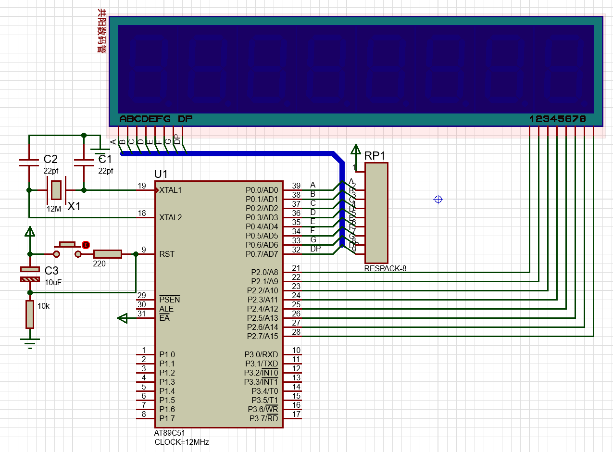
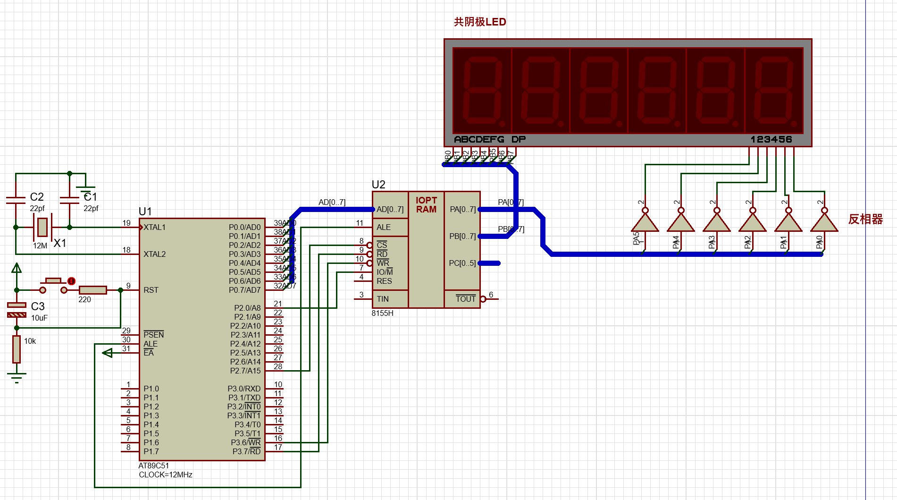
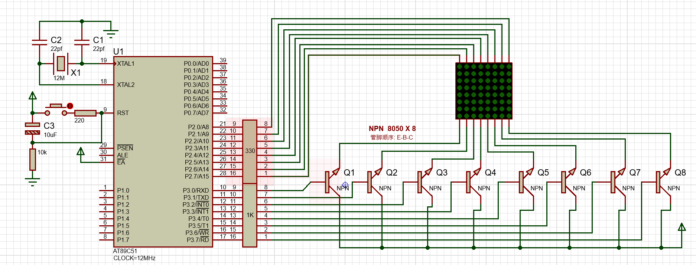
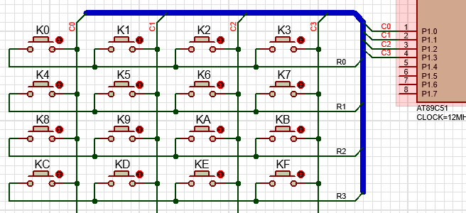

# 常用函数实现
## 延时函数
```
void delay_ms(INT16U x) 
{
	INT8U t; while(x--) for(t = 0; t < 120; t++);
}
```

## 独立按键扫描
```
uchar keybd()
{
    P1=0xFF; 
    if(~P1)
    {
    i=(~P1)&0x3F;
    delay_ms(10);						 //去抖动
    if(((~P1)&0x3F)==i)
    switch(i){
        case 0x01:i=0;
                    while(~P1);			 //等待键释放，下同
                    break;
        case 0x02:i=0;while(~P1);break;
        case 0x04:i=1;while(~P1);break;
        case 0x08:i=2;while(~P1);break;
        case 0x10:i=3;while(~P1);break;
        case 0x20:i=4;while(~P1);break;
        case 0x40:i=5;while(~P1);break;
            }
        }
        return i;
}


```

## IIC 函数
```
//在IIC上产生起始信号
void Start()
{
	SDA=1;
	SCL=1;
	NOP4();		//执行四次NOP（空操作），延时，下同
	SDA=0;
	NOP4();
	SCL=0;
}
//在IIC上产生停止信号
void Stop()
{
	SDA=0;
	SCL=0;
	NOP4();
	SCL=1;
	NOP4();
	SDA=1;
} 
//读取应答
void RACK()
{
	SDA=1;
	NOP4();
	SCL=1;
	NOP4();
	SCL=0;
}
//发送非应答信号
void NO_ACK()
{
	SDA=1;
	SCL=1;
	NOP4();
	SCL=0;
	SDA=0;
}
```

# 51知识
## XBYTE
XBYTE 是Keil C51编译器提供的扩展关键字，属于absacc.h头文件中的宏，用于直接访问8051的外部数据存储器空间（XDATA）。其底层实现为：
`#define XBYTE ((unsigned char volatile xdata *) 0)`    
作用：将外部存储器的16位地址映射为指针，通过数组形式访问
寻址范围：0x0000~0xFFFF（共64KB）

# 数码管代码
```
//共阳数码管0~9的数字段码表
code INT8U SEG_CODE[] = {0xC0,0xF9,0xA4,0xB0,0x99,0x92,0x82,0xF8,0x80,0x90};
```
动态扫描原理图：    


## 数码管动态扫描汇编版
```
MAIN: 
      MOV   70H,  #02H		   ;将单片机RAM地址70H - 77H设置为缓存单元，填入显示的内容，比如20200312
      MOV   71H,  #00H		   
      MOV   72H,  #02H
      MOV   73H,  #00H
      MOV   74H,  #00H
      MOV   75H,  #03H
	  MOV   76H,  #01H
      MOV   77H,  #02H

AGAIN:ACALL  DISP1 ;
      SJMP   AGAIN ;主程序末尾应跳转至再次刷新显示或原地等待

;----------------------------------------显示子程序------------            
DISP1:MOV	R0, #77H           ;R0作显示缓存区的指针，初始指向77H单元，初始选中最右LED
      MOV	R2, #10000000B     ;R2存放位选码，初始选中KED最右位
LOOP:MOV    A, #00H
     MOV    P2, A				;先关闭所有位
     MOV    A, @R0
     MOV    DPTR, #PTRN          
     MOVC   A, @A+DPTR         ;查段选码PTRN，将显示缓存单元的数字代码转换为对应的段选码
     MOV    P0, A	 		   ;输出段选码
     MOV    P2,  R2			   ;
     CALL    D1MS			
     DEC	 R0			
     MOV     A, R2			
     CLR	 C			
     RRC	 A			
     JC	    PASS			   ;判断是否8位都已经显示完毕，是就转到PASS
     MOV     R2,   A		   ;还没显示完，就继续循环
     AJMP	LOOP	
PASS: MOV   A,    #00H
     MOV    P2, A              ;退出子程序前，关闭所有位   
     RET		
;----------------延时1ms子程序--------------------------		   
D1MS:MOV	R7, #02H		      
DMS:MOV         R6, #0FFH
    DJNZ	R6, $
    DJNZ	R7, DMS	
    RET

;----------------共阳极段码表---------------------------
PTRN:DB 0C0H, 0F9H, 0A4H, 0B0H, 99H
     DB 92H, 82H, 0F8H, 80H, 90H


;----------------共阴级段码表---------------------------
PTRNC:DB 3FH, 06H, 5BH, 4FH, 66H
     DB 6DH, 7DH, 07H, 7FH, 6FH

	END
```

## 数码管动态扫描C语言版

```
void main()
{
	INT8U i;  
	array[3]=1;
	while (1)
	{
	   for ( i=0; i<8; i++ ) //扫描显示8位数码管
	   { P0= 0xff;		//段码口输出全1，即先关闭
	     P2=1 << i;		//输出位选码		 00000001   	  00000010       00000100       ....    10000000
		 P0=SEG_CODE[array[i]];	 //输出段选码
		 delay_ms(4);	     
	   }  					 
	}
}
```
# 8155扩展,数码管显示   

原理图如下：    
    

## C语言代码

```
#include<reg52.h>
#include<absacc.h>
#include <intrins.h>
#define uchar unsigned char
#define uint unsigned int
#define dula_data XBYTE[0x7f02]	  //8155 PB口地址 
#define wela_data XBYTE[0x7f01]	  //8155 PA口地址
#define dispcom XBYTE[0x7f00]	  //8155命令寄存器地址
uchar code table[]={
0x3f,0x06,0x5b,0x4f,
0x66,0x6d,0x7d,0x07,
0x7f,0x6f,0x77,0x7c,
0x39,0x5e,0x79,0x71,
0x76,0x38};
void delay(uint x)
{
	uint i,j;
	for(i=x;i>0;i--)
		for(j=11;j>0;j--) ;
}
void main()
{                       
    dispcom=0x03;
    //使用8155前别忘了应先对其初始化,
    //设置其口的工作方式、输出输入方向！
    //这里设置PA口，PB口为基本输出方式，为输出口。   
    while(1)	    			 
   {
    wela_data=0x20;
    dula_data=table[5];
		delay(5);
                
    wela_data=0x10;
    dula_data=table[4];
		delay(5);
                
    wela_data=0x08;
    dula_data=table[3];
		delay(5);
                
    wela_data=0x04;
    dula_data=table[2];
		delay(5);
                
    wela_data=0x02;
    dula_data=table[1];
		delay(5);
                
    wela_data=0x01;
    dula_data=table[0];
		delay(5);          
    }
}
```


# 点阵屏幕显示C代码

原理图如下：    
    
```
//  名称: TIMER0控制8×8LED点阵屏显示数字


#include <reg51.h>
#include <intrins.h>
#define INT8U   unsigned char
#define INT16U  unsigned int
//-----------------------------------------------------------------
// 数字点阵
//-----------------------------------------------------------------
INT8U code DotMatrix[] = 
{	0x00,0x3E,0x41,0x41,0x41,0x3E,0x00,0x00,	//0	的点阵码
	0x00,0x00,0x00,0x21,0x7F,0x01,0x00,0x00,	//1	的点阵码
	0x00,0x27,0x45,0x45,0x45,0x39,0x00,0x00,	//2	的点阵码
	0x00,0x22,0x49,0x49,0x49,0x36,0x00,0x00,	//3	的点阵码
	0x00,0x0C,0x14,0x24,0x7F,0x04,0x00,0x00,	//4	的点阵码
	0x00,0x72,0x51,0x51,0x51,0x4E,0x00,0x00,	//5	的点阵码
	0x00,0x3E,0x49,0x49,0x49,0x26,0x00,0x00,	//6	的点阵码
	0x00,0x40,0x40,0x40,0x4F,0x70,0x00,0x00,	//7	的点阵码
	0x00,0x36,0x49,0x49,0x49,0x36,0x00,0x00,	//8	的点阵码
	0x00,0x32,0x49,0x49,0x49,0x3E,0x00,0x00		//9	的点阵码
};
INT8U i=0,t=0,Num_Index,cs; 

//------------------------------------------------------------------
// 主程序
//------------------------------------------------------------------
void main() 
{  
 //P3=0x80;       //列选码初值1000000B，经左移1位，根据连线图可知最先选C0列
  cs=0x80;
 Num_Index=0;    //从“0 ”开始显示 
 TMOD=0x00;      //T0 工作在方式 0 、作13位的定时器
 TH0=(8192-2000)/32;   //求定时 2ms的初值，高8位放TH0,
 TL0=(8192-2000)%32;  //初值低5位放TL0 （2^13=8192，2^5=32）
 IE=0x82;    //开T0中断和总中断
 TR0=1;      //启动 T0 
 while(1);    //无限循环，(每当定时时间到，则执行中断函数一次)
} 

//------------------------------------------------------------------
// T0定时器溢出中断函数控制LED点阵屏刷新显示
//------------------------------------------------------------------
void LED_Screen_Refresh() interrupt 1 
{
    TH0=(8192-2000)/32;      //重置初值 
    TL0=(8192-2000)%32; 
	
//	P2=0xff;        //输出点阵码 
    P3=0x00;
	P2=~DotMatrix[Num_Index*8+i]; //因LED是共阳极故取反
    cs=_crol_(cs,1);
	P3=cs;
   //P3=_crol_(P3,1);  //P3值循环左移1位，调整列选码并输出	
   if(++i==8) i=0;   //每个数字的点阵码有 8 个字节 
   if(++t==250)    //每个数字刷新显示一段时间(执行该函数250次
                     //即约250×2ms后调整指针Num_Index显示下一个 
 { 
    t=0; 
    if(++Num_Index==10) Num_Index=0; //偏移量加1，显示
             //下一个数字,若偏移量加1后=10，则重置为从0开始 
 } 


``` 

# 独立连接键盘C代码


```
#include <reg52.h>
#define uchar	unsigned char
#define uint	unsigned int
//0~9的共阴数码管段码表
code uchar SEG_CODE[] = { 0x3F,0x06,0x5B,0x4F,0x66,0x6D,0x7D,0x07,0x7F,0x6F,0x40};
uchar keybd();
uchar i=10;			             //初始显示短横线
void delay_ms(uchar x) {
	uchar t; while(x--) for(t = 0; t < 120; t++);
}
  
void main()
{  						 
   while(1){
	P2=	 SEG_CODE[keybd()]	;
	}
}
uchar keybd()
{
			P1=0xFF; 
			if(~P1)
			{
			i=(~P1)&0x3F;
			delay_ms(10);						 //去抖动
			if(((~P1)&0x3F)==i)
			switch(i){
				case 0x01:i=0;
				          while(~P1);			 //等待键释放，下同
						  break;
				case 0x02:i=1;while(~P1);break;
				case 0x04:i=2;while(~P1);break;
				case 0x08:i=3;while(~P1);break;
				case 0x10:i=4;while(~P1);break;
				case 0x20:i=5;while(~P1);break;
			        }
			 }
			 return i;
}

```

# 矩阵键盘（线反转法）

原理图：    
        
```
// 键盘扫描函数 (4x4矩阵键盘)
void Keys_Scan()
{ 
	P3 = 0x00;   // 列输出低电平
	P1 = 0x0f;   // 行输入带上拉
	delay_ms(1);
	
	if (P1 == 0x0f) // 无按键
	{
		keyNo = 0xff;
		return;
	}

	// 检测按键所在的列
	switch (P1)
	{
		case 0x0e: keyNo = 0; break;  // 第0列 
		case 0x0d: keyNo = 1; break;  // 第1列
		case 0x0b: keyNo = 2; break;  // 第2列
		case 0x07: keyNo = 3; break;  // 第3列
		default:   keyNo = 0xff; return;
	}

	// 检测按键所在的行
	P1 = 0x00;   // 行输出低电平
	P3 = 0xff;   // 列输入带上拉
	delay_ms(1);
	
	if (P3 == 0xff) // 无按键
	{
		keyNo = 0xff;
		return;
	}
	
	switch(P3)
	{
		case 0xfe: keyNo += 0;  break; // 第0行 
		case 0xfd: keyNo += 4;  break; // 第1行
		case 0xfb: keyNo += 8;  break; // 第2行
		case 0xf7: keyNo += 12; break; // 第3行
		default:   keyNo = 0xff;
	}
}
```

# 8155扩展按键，使用行扫描法
```
#include<reg52.h>
#include<absacc.h>
#include <intrins.h>
#define uchar unsigned char
#define uint unsigned int
#define dula_data XBYTE[0x7f02]  //8155 PB口地址 
#define scan_data XBYTE[0x7f01]	  //8155 PA口地址  扫描口
#define read_data XBYTE[0x7f03]	  //8155 PC口地址  回扫口
#define dispcom XBYTE[0x7f00]	  //8155命令寄存器地址
sbit LED = P1^0;
uchar code table[]={
0x3f,0x06,0x5b,0x4f,
0x66,0x6d,0x7d,0x07,
0x7f,0x6f,0x77,0x7c,
0x39,0x5e,0x79,0x71,
0x76,0x38};		  
uchar keyNo = 0xff;
void key8155();
void delay_ms(uint x)
{
	uchar t;
	while(x--) for(t = 0; t < 120; t++);
}
//--------------------主程序------------------------------------------------------------------------------------------------
void main()
{   uchar keyNo_temp =0xff;                    
    dispcom=0x01;              // 使用8155前应先对其初始化设置其口的工作方式、输出输入方向！A口基本输出方式，C口为输入方式   
	while(1)	    			  
	{	key8155();
	    if(keyNo==0xff) {delay_ms(10);continue;}
		keyNo_temp= keyNo;						 //有按键	 
		while(key8155(), keyNo!= 0xff);			 // 等键释放 
		LED = ~LED; 							 
		DBYTE[0x70]= keyNo_temp;    			 
	}
}
//---------------------键盘接口子程序----------------------------------------------------------------------------------------
void key8155()
{    uchar i;
     scan_data = 0x00 ;	 
	 delay_ms(1);
	 if (((~read_data)&0x0f) == 0x00)
	 {
		keyNo = 0xff;
		return;               //无按键提前返回
	 }	
	 delay_ms(10);	          //去抖动
     scan_data = 0x00 ;	 
	 delay_ms(1);
	 if (((~read_data)&0x0f) == 0x00)
	 {
		keyNo = 0xff;
		return;               //无按键提前返回
	 }
	 for(i=0; i<8; i++)
	 {   
	 	 scan_data =~(1 << i);	
		 delay_ms(1);
		 
		 switch((~read_data)&0x0f)
		 {	case 0x01:keyNo=0+i; return;		//赋值键号=首行键号+列号；返回
		    case 0x02:keyNo=8+i; return;
			case 0x04:keyNo=16+i; return;
			case 0x08:keyNo=24+i; return; 
			case 0x00:break;					//不是此列有按键。break，扫描下一列
			
		 }
	     	    
	 }
    	keyNo = 0xff;
		return; 
}


```

# LCD 1602字符液晶工作代码

```
#include <reg51.h>	
#define uchar unsigned char 
#define uint unsigned int
uchar code table1[]="I LOVE MCU!";        //第一行显示的字符,共11个
uchar code table2[]="WWW.YNMEC.COM";      //第二行显示的字符，共13个
sbit RS=P2^5;          //单片机端口定义
sbit RW=P2^6;
sbit E=P2^7;
uchar num;
void delay(uint xms)      //----------延时子函数--------------------
{
	uint i,j;
	for(i=xms;i>0;i--)
		for(j=125;j>0;j--);
}

void write_com(uchar com)     //---------写命令子函数------------
{	RS=0;        //写命令
	RW=0;       //写模式
    P0=com;     //将命令字送到数据线上
	delay(5);     //稍延时
    E=1;  //给E一个高脉冲将命令字送入液晶控制器，完成写操作
	delay(5);
	E=0;
}
void write_data(uchar date)  //---------写数据子函数---------------
{	RS=1;             //写数据
	RW=0;            // 写模式
	P0 = date;       //将要写的数据送到数据线上
	delay(5);        //稍延时
     E=1;   //给E一个高脉冲将命令字送入液晶控制器，完成写操作
	delay(5);
	E=0;
}
void LCD1602_init()      //--------------LCD1602初始化设置------------
{
	E=0;
    write_com(0x38);      //设置8位数据接口，16×2显示，5×7点阵
    write_com(0x0c);      //设置开显示，光标不显示
    write_com(0x06);      //写一个字符后地址指针自动加上
    write_com(0x01);      //清屏，数据指针清0
}

//---------------------主函数-----------------------------------------
void main()
{	LCD1602_init();
	write_com(0x80);      //DDRAM数据指针定位在第一行第一个字符处
	for(num=0;num<11;num++)  //写第一行要显示的信息
	{	write_data(table1[num]);
		delay(5);     //每两个字符间稍延时
	}
	write_com(0x80+0x40); // 数据指针定位在第二行首字符处
	for(num=0;num<13;num++)   //写第二行要显示的信息
	{
		write_data(table2[num]);
	           delay(5);
	}
	while(1);
}

```
# 24C04使用  (IIC)


```
#include<reg51.h>
#include<intrins.h>	
#define uchar unsigned char
#define uint unsigned int
#define NOP4() {_nop_();_nop_();_nop_();_nop_();}
sbit SCL=P1^0;
sbit SDA=P1^1;
sbit SPK=P3^0;					//蜂鸣器输出端
//标准音阶频率对应的定时初值表		 按照1234567和高音的1234567存放，共14个音符，即数组第0~6对应音符1234567，第7~13对应高音音符1234567.
uchar code HI_LIST[]={226,229,232,233,236,238,240,241,242,244,245,246,247,248}; //依次对应1234567和高音的1234567的T0高位定时初值
uchar code LO_LIST[]={4,13,10,20,3,8,6,2,23,5,26,1,4,3};   //依次对应1234567和高音的1234567的T0低位定时初值
//待写入24C04的音符
uchar code Song_24C04[]={0,1,2,0,0,1,2,0,2,3,4,4,2,3,4,4};//1234567音符分别对应上面数组的0123456位置，所以要把简谱里的音符号要减1后存入
//uchar code Song2_24C04[]={0,0,4,4,5,5,4,4,3,3,2,2,1,1,0,0,4,4,3,3,2,2,1,1,4,4,3,3,2,2,1,1,0,0,4,4,5,5,4,4,3,3,2,2,1,1,0,0};//小星星
uchar sidx;			//读取音符索引
//延时
void DelayMS(uint ms)
{	
	uchar i;
	while(ms--) for(i=0;i<120;i++);
}
//在IIC上产生起始信号
void Start()
{
	SDA=1;
	SCL=1;
	NOP4();		//执行四次NOP（空操作），延时，下同
	SDA=0;
	NOP4();
	SCL=0;
}
//在IIC上产生停止信号
void Stop()
{
	SDA=0;
	SCL=0;
	NOP4();
	SCL=1;
	NOP4();
	SDA=1;
} 
//读取应答
void RACK()
{
	SDA=1;
	NOP4();
	SCL=1;
	NOP4();
	SCL=0;
}
//发送非应答信号
void NO_ACK()
{
	SDA=1;
	SCL=1;
	NOP4();
	SCL=0;
	SDA=0;
}
//向24C04中写一个字节数据
void Write_A_Byte(uchar b)
{
	uchar i;
	for(i=0;i<8;i++)
	{
		b<<=1;	    //将要传输的字节左移一位,最高一位移到了进位位C中，（CY就是表示进位位c）
		SDA=CY;		
		_nop_();
		SCL=1;
		NOP4();
		SCL=0;
	}
	RACK();			//接收从机的应答信号
}
//向指定地址写数据
void Write_IIC(uchar addr,uchar dat)
{
	Start();
	Write_A_Byte(0xa0);
	Write_A_Byte(addr);
	Write_A_Byte(dat);
	Stop();
	DelayMS(10);
}
//从24C04中读一个字节数据
uchar Read_A_Byte()
{
	uchar i,b;      
	for(i=0;i<8;i++)
	{
		SCL=1;
		b<<=1;		  //当前b左移1位————各位往高位移1位，最低位变为0
		b|=SDA;		  //b的最低位与SDA线上的值相“或”，“或”后结果放b的最低位	,就等价于将读取到的当前位数据放进b中最低位（之后经多次移位，移到对应的数据位上）
		SCL=0;
	}
	return b;		  //返回值b中内容就是读到的一个字节
}
//从当前地址读取数据
uchar Read_Current()
{
	uchar d;
	Start();
	Write_A_Byte(0xa1);
	d=Read_A_Byte();  //读取到的字节数据放d中
	NO_ACK();
	Stop();
	return d;
}
//从任意地址读取数据
uchar Random_Read(uchar addr)
{
	Start();
	Write_A_Byte(0xa0);
	Write_A_Byte(addr);
	Stop();
	return Read_Current();
}
//定时器0中断
void T0_INT() interrupt 1
{
	SPK=~SPK;    	   // P3.0电平反转一次
	TH0=HI_LIST[sidx];
	TL0=LO_LIST[sidx];
}
//主程序
void main()
{
	uint i;
	IE=0x82;
	TMOD=0x00;					   //设置定时器 T0为13位定时器
	for(i=0;i<16;i++)			   //将存放在Song_24C04[]的乐谱写入24C04。其实实际上该写入步骤并不是在主函数执行。实际应是预先将多首歌曲乐谱存入24C04，掉电不会丢失，
	                               //而单片机在程序中只需要对24c04进行读操作，依次取出并播放
	{
		Write_IIC(i,Song_24C04[i]);
	} 

/*		for(i=0;i<48;i++)		   //将存放在Song2_24C04[]的乐谱写入24C04。其实实际上该写入步骤并不是在主函数执行。实际应是预先将多首歌曲乐谱存入24C04，掉电不会丢失，
	                               //而单片机在程序中只需要对24c04进行读操作，依次取出并播放
	{
		Write_IIC(i,Song2_24C04[i]);	 
	}								 */

	while(1)			 			//读取一个音符并播放，重复16次
	{
    	for(i=0;i<16;i++)			//从24C04中读取第1首	
	/*	   	for(i=0;i<48;i++)			//从24C04中读取第2首   */
		{
			sidx=Random_Read(i);	//从指定地址读取
			TH0=HI_LIST[sidx];
	        TL0=LO_LIST[sidx];
			TR0=1;					//启动定时器，让播放
			DelayMS(350);			//该延时控制每个音符播放的时长，该延时短则体现出乐曲节拍快，反之节拍慢
		}
	}
}


```

# PCA9544 使用      

```
#include<reg51.h>
#include<intrins.h>	
#define uchar unsigned char
#define uint unsigned int
#define NOP4() {_nop_();_nop_();_nop_();_nop_();}
sbit SCL=P0^0;
sbit SDA=P0^1;
#define PCA9554_LED 0x40
#define PCA9554_KEY 0x42
uchar buffer1[1];
uchar buffer2[1];
//延时
void DelayMS(uint ms)
{	
	uchar i;
	while(ms--) for(i=0;i<120;i++);
}
//在IIC上产生起始信号
void Start()
{
	SDA=1;
	SCL=1;
	NOP4();		//执行四次NOP（空操作），延时，下同
	SDA=0;
	NOP4();
	SCL=0;
}
//在IIC上产生停止信号
void Stop()
{
	SDA=0;
	SCL=0;
	NOP4();
	SCL=1;
	NOP4();
	SDA=1;
} 
//读取应答
void RACK()
{
	SDA=1;
	NOP4();
	SCL=1;
	NOP4();
	SCL=0;
}
//发送非应答信号
void NO_ACK()
{
	SDA=1;
	SCL=1;
	NOP4();
	SCL=0;
	SDA=0;
}
//向24C04中写一个字节数据
void Write_A_Byte(uchar b)
{
	uchar i;
	for(i=0;i<8;i++)
	{
		b<<=1;	    //将要传输的字节左移一位,最高一位移到了进位位C中，（CY就是表示进位位c）
		SDA=CY;		
		_nop_();
		SCL=1;
		NOP4();
		SCL=0;
	}
	RACK();			//接收从机的应答信号
}
//向指定地址写数据
void Write_IIC(uchar addr,uchar dat)
{
	Start();
	Write_A_Byte(0xa0);
	Write_A_Byte(addr);
	Write_A_Byte(dat);
	Stop();
	DelayMS(10);
}
//从中读一个字节数据
uchar Read_A_Byte()
{
	uchar i,b;      
	for(i=0;i<8;i++)
	{
		SCL=1;
		b<<=1;		  //当前b左移1位————各位往高位移1位，最低位变为0
		b|=SDA;		  //b的最低位与SDA线上的值相“或”，“或”后结果放b的最低位	,就等价于将读取到的当前位数据放进b中最低位（之后经多次移位，移到对应的数据位上）
		SCL=0;
	}
	return b;		  //返回值b中内容就是读到的一个字节
}
//从当前地址读取数据
uchar Read_Current()
{
	uchar d;
	Start();
	Write_A_Byte(0xa1);
	d=Read_A_Byte();  //读取到的字节数据放d中
	NO_ACK();
	Stop();
	return d;
}
//从任意地址读取数据
uchar Random_Read(uchar addr)
{
	Start();
	Write_A_Byte(0xa0);
	Write_A_Byte(addr);
	Stop();
	return Read_Current();
}
void ISendStr(uchar sla,uchar suba,uchar (*s)[1])
{
			Start();
			Write_A_Byte(sla);
			Write_A_Byte(suba);
			Write_A_Byte((*s)[0]);
			Stop();
			DelayMS(10);
				
}
void IRcvStr(uchar sla,uchar suba,uchar (*s)[1])
{
//			Start();
//			Write_A_Byte(sla);
//			Write_A_Byte(suba);
//			Write_A_Byte(0x43);
//			(*s)[0]=Read_A_Byte();
//			Stop();
//			DelayMS(10);
				Write_IIC(sla,suba);
				Start();
				Write_A_Byte(0x43);
				(*s)[0]=Read_A_Byte();
				Stop();
				DelayMS(10);
}
void main()
{
			buffer1[0]=0x00;
			ISendStr(PCA9554_LED,0x03,&buffer1);
			buffer1[0]=0xff;
			ISendStr(PCA9554_LED,0x01,&buffer1);//初始输出全1，LED全灭。
			while(1)
			{
				IRcvStr(PCA9554_KEY,0x00,&buffer2);
				ISendStr(PCA9554_LED,0x01,&buffer2);
			}
			
			

}


```


# ADC0809读取，LCD1602显示显示
```
#include <reg51.h>       // 8051标准头文件
#include <intrins.h>     // 内联函数库（包含_nop_()）
#define uchar unsigned char  // 定义无符号字符类型简写
#define uint unsigned int    // 定义无符号整型简写
#define NOP4() {_nop_();_nop_();_nop_();_nop_();}  // 4个空指令延时宏

// I2C通信引脚定义（用于PCA9554通信）
sbit SCL = P0^0;  // I2C时钟线
sbit SDA = P0^1;  // I2C数据线

// PCA9554器件地址定义（用于LCD数据线控制）
#define PCA9554_LCD 0x40  // 器件地址：A0A1A2=000（二进制01000000）

// ADC0809引脚定义
sbit OE  = P1^0;    // 输出使能（高电平有效）
sbit EOC = P1^1;    // 转换结束标志（低电平表示转换中）
sbit ST  = P1^2;    // 启动转换信号（上升沿触发）
sbit CLK = P1^3;    // 时钟输入（典型频率500kHz）

// LCD1602控制引脚定义
sbit RS = P2^0;     // 寄存器选择（0=指令寄存器，1=数据寄存器）
sbit RW = P2^1;     // 读写控制（0=写，1=读）
sbit E  = P2^2;     // 使能信号（下降沿执行命令）

// 全局变量
uchar adc_raw;       // 存储ADC原始值（0-255）

// 通道3选择参数（对应ADC0809的IN3通道）
const uchar channel_three[3] = {0, 0, 1};  // 二进制011选择IN3

// 函数声明
void DelayMS(uint ms);                // 毫秒级延时
void I2C_Start();                     // I2C起始信号
void I2C_Stop();                      // I2C停止信号
void I2C_SendByte(uchar dat);         // I2C发送单字节
void PCA9554_Write(uchar addr, uchar reg, uchar dat); // PCA9554写操作
void ADC_Init();                      // ADC初始化
uchar ADC_Read();                     // ADC读取数据
void LCD_Init();                      // LCD初始化
void LCD_Cmd(uchar cmd);              // 发送LCD指令
void LCD_Data(uchar dat);             // 发送LCD数据
void Timer0_Init();                   // 定时器0初始化（用于ADC时钟）
void Display_Voltage(uint voltage);   // 电压显示函数

// 定时器0中断服务函数（为ADC0809提供时钟）
void Timer0_ISR() interrupt 1 {  // 中断号1对应定时器0
    CLK = !CLK;  // 翻转时钟信号（产生方波）
}

// 主函数
void main() {
    uint voltage;  // 存储计算后的电压值（单位：mV）
    
    Timer0_Init();  // 初始化定时器（用于ADC时钟）
    ADC_Init();     // 初始化ADC0809
    PCA9554_Write(PCA9554_LCD, 0x03, 0x00); // 配置PCA9554的PORT0为输出模式
    LCD_Init();     // 初始化LCD1602
    
    while(1) {
        adc_raw = ADC_Read();  // 读取ADC值（通道3）
        // 将ADC值转换为电压（0-5V对应0-5000mV）
        voltage = (uint)adc_raw * 5000UL / 255; 
        Display_Voltage(voltage);  // LCD显示电压
        DelayMS(100);              // 采样间隔100ms
    }
}

// 定时器0初始化（模式2，自动重载）
void Timer0_Init() {
    TMOD = 0x02;    // 设置定时器模式2（8位自动重载）
    TH0 = TL0 = 230; // 定时初值（12MHz晶振下约52μs周期）
    ET0 = 1;        // 使能定时器0中断
    EA = 1;         // 开启总中断
    TR0 = 1;        // 启动定时器0
}

// ADC0809初始化
void ADC_Init() {
    P1 = 0x3F;      // 初始化P1口（高两位保留，低6位用于ADC控制）
    OE = 0;         // 输出使能置低
    ST = 0;         // 转换启动信号置低
    CLK = 0;        // 时钟初始低电平
}

// 读取ADC值（通道3）
uchar ADC_Read() {
    uchar result;
    ST = 0;         // 确保ST初始低电平
    ST = 1;         // 产生上升沿启动转换
    ST = 0;
    while(EOC == 0); // 等待转换完成（EOC变高）
    _nop_(); _nop_(); // 短暂延时确保稳定
    OE = 1;         // 允许输出数据
    result = P3;    // 从P3口读取转换结果
    OE = 0;         // 关闭输出
    return result;
}

// LCD1602初始化
void LCD_Init() {
    PCA9554_Write(PCA9554_LCD, 0x01, 0x00); // 初始化PCA9554输出寄存器
    LCD_Cmd(0x38);  // 功能设置：8位总线，2行显示，5x8点阵
    LCD_Cmd(0x0C);  // 显示控制：开显示，关光标
    LCD_Cmd(0x06);  // 输入模式：地址递增，不移屏
    LCD_Cmd(0x01);  // 清屏
    DelayMS(5);     // 等待清屏完成
}

// 发送LCD指令
void LCD_Cmd(uchar cmd) {
    RS = 0;         // 选择指令寄存器
    RW = 0;         // 设置为写模式
    PCA9554_Write(PCA9554_LCD, 0x01, cmd); // 通过PCA9554发送指令
    E = 1;          // 使能信号高电平
    DelayMS(2);     // 保持使能
    E = 0;          // 下降沿执行指令
    DelayMS(2);     // 指令执行时间
}

// 发送LCD数据
void LCD_Data(uchar dat) {
    RS = 1;         // 选择数据寄存器
    RW = 0;         // 设置为写模式
    PCA9554_Write(PCA9554_LCD, 0x01, dat); // 通过PCA9554发送数据
    E = 1;          // 使能信号高电平
    DelayMS(2);     
    E = 0;          // 下降沿写入数据
    DelayMS(2);
}

// 在LCD显示电压值（格式：X.XXV）
void Display_Voltage(uint voltage) {
    uchar str[6];   // 显示缓冲区
    uchar i;
    // 电压分解：整数部分+两位小数
    uchar integer_part = voltage / 1000;        // 提取整数位（0-5）
    uchar fractional = (voltage % 1000) / 10;   // 提取小数部分（0-99）
    uchar decimal1 = fractional / 10;           // 十位小数
    uchar decimal2 = fractional % 10;           // 个位小数
    
    // 构建显示字符串
    str[0] = integer_part + '0';  // 整数转ASCII
    str[1] = '.';                 // 小数点
    str[2] = decimal1 + '0';      // 十位小数转ASCII
    str[3] = decimal2 + '0';      // 个位小数转ASCII
    str[4] = 'V';                 // 单位符号
    str[5] = '\0';                // 字符串结束符
    
    LCD_Cmd(0x80);  // 设置光标到第一行首
    for(i = 0; i < 5; i++) {
        LCD_Data(str[i]);  // 逐个字符显示
    }
}

// I2C起始信号（SCL高时SDA下降沿）
void I2C_Start() {
    SDA = 1;  // 确保SDA高
    SCL = 1;  // SCL高电平
    NOP4();   // 保持时间
    SDA = 0;  // SDA下降沿
    NOP4();
    SCL = 0;  // 准备数据传输
}

// I2C停止信号（SCL高时SDA上升沿）
void I2C_Stop() {
    SDA = 0;  // 确保SDA低
    SCL = 0;  // SCL低电平
    NOP4();
    SCL = 1;  // SCL上升沿
    NOP4();
    SDA = 1;  // SDA上升沿
}

// I2C发送单字节（MSB first）
void I2C_SendByte(uchar dat) {
    uchar i;
    for(i = 0; i < 8; i++) {
        SDA = (dat & 0x80) ? 1 : 0;  // 取出最高位
        dat <<= 1;                   // 左移准备下一位
        SCL = 1;                     // 时钟上升沿
        NOP4();                      // 保持时间
        SCL = 0;                     // 时钟下降沿
    }
    SDA = 1;  // 释放SDA线（等待ACK）
    SCL = 1;  // 第9个时钟脉冲
    NOP4();
    SCL = 0;
}

// PCA9554写操作（三步：地址+寄存器+数据）
void PCA9554_Write(uchar addr, uchar reg, uchar dat) {
    I2C_Start();             // 起始信号
    I2C_SendByte(addr);      // 发送器件地址（写模式）
    I2C_SendByte(reg);       // 发送寄存器地址
    I2C_SendByte(dat);       // 发送数据
    I2C_Stop();              // 停止信号
}

// 毫秒级延时（12MHz晶振下近似延时）
void DelayMS(uint ms) {
    uint i, j;
    for(i = 0; i < ms; i++)
        for(j = 0; j < 125; j++);  // 内循环约1ms
}

```

# DAC0832使用

原理图：    
        

```
//-----------------------------------------------------------------
// 用DAC0832生成锯齿波 
//-----------------------------------------------------------------
//   本例程序向DAC0832反复输出0x00-0xFF的数字量，经过数/模转
//        换及电流到电压的转换后输出锯齿波.
//               
//-----------------------------------------------------------------
#include <reg51.h>
#include <absacc.h>
#define INT8U unsigned char
#define INT16U  unsigned int
#define OUTDATA XBYTE[0x7FFF]	   //向0832输出转换数据的地址

//-----------------------------------------------------------------
// 延时子程序	如果晶振是6M，则这里表示延时2倍的x毫秒 ,如果晶振12M，则是延时x毫秒
//-----------------------------------------------------------------
void delay_ms(INT16U x) 
{
    INT8U t;
	while(x--)  for(t = 0; t < 120; t++);
}
//-----------------------------------------------------------------
// 主程序	 
//-----------------------------------------------------------------
void main()
{	INT8U i;
    while(1)
	{ for(i=0; i<256; i++)
	  {    OUTDATA=i;
	 	  delay_ms(1);
	  }	 
	}
}
```


# 个人代码

## 实验一 点阵led显示

```
//-----------------------------------------------------------------
//  名称: TIMER0控制8×8LED点阵屏显示数字
//-----------------------------------------------------------------
//  说明: 8×8LED点阵屏循环显示数字0-9,刷新过程由T0定时器溢出中断完成.
//   
//-----------------------------------------------------------------
#include <reg51.h>
#include <intrins.h>
#define INT8U   unsigned char
#define INT16U  unsigned int
//-----------------------------------------------------------------
// 数字点阵
//-----------------------------------------------------------------
INT8U code DotMatrix[] = 
{	
	0x00,0x00,0x00,0x21,0x7F,0x01,0x00,0x00,	//1	的点阵码
	0x00,0x00,0x00,0x21,0x7F,0x01,0x00,0x00,	//1	的点阵码
	0x00,0x27,0x45,0x45,0x45,0x39,0x00,0x00,	//2	的点阵码
	0x00,0x27,0x45,0x45,0x45,0x39,0x00,0x00,	//2	的点阵码
	0x00,0x3E,0x41,0x41,0x41,0x3E,0x00,0x00,	//0	的点阵码
	0x00,0x3E,0x41,0x41,0x41,0x3E,0x00,0x00,	//0	的点阵码
	0x00,0x27,0x45,0x45,0x45,0x39,0x00,0x00,	//2	的点阵码
	0x00,0x22,0x49,0x49,0x49,0x36,0x00,0x00,	//3	的点阵码
	0x00,0x27,0x45,0x45,0x45,0x39,0x00,0x00,	//2	的点阵码

	0x93,0x96,0x9c,0xfd,0x9e,0x93,0x13,0x00,
	0x38,0x00,0x3e,0xc2,0x02,0x26,0x10,0x00,
	0x44,0x4c,0xde,0x52,0x62,0x42,0x02,0x00,
	0xa6,0x1e,0x62,0x52,0x46,0xfe,0x42,0x00,
	
	

	0x10,0xFE,0x92,0x92,0xFE,0x92,0x10,0x10	//zhong
};
INT8U i=0,t=0,Num_Index,cs; 

//------------------------------------------------------------------
// 主程序
//------------------------------------------------------------------
void main() 
{  
 //P3=0x80;       //列选码初值1000000B，经左移1位，根据连线图可知最先选C0列
  cs=0x80;
 Num_Index=0;    //从“0 ”开始显示 
 TMOD=0x00;      //T0 工作在方式 0 、作13位的定时器
 TH0=(8192-2000)/32;   //求定时 2ms的初值，高8位放TH0,
 TL0=(8192-2000)%32;  //初值低5位放TL0 （2^13=8192，2^5=32）
 IE=0x82;    //开T0中断和总中断
 TR0=1;      //启动 T0 
 while(1);    //无限循环，(每当定时时间到，则执行中断函数一次)
} 

//------------------------------------------------------------------
// T0定时器溢出中断函数控制LED点阵屏刷新显示
//------------------------------------------------------------------
void LED_Screen_Refresh() interrupt 1 
{
    TH0=(8192-2000)/32;      //重置初值 
    TL0=(8192-2000)%32; 
	
//	P2=0xff;        //输出点阵码 
    P3=0x00;
	  P2=~DotMatrix[Num_Index*8+i]; //因LED是共阳极故取反
    cs=_crol_(cs,1);
	  P3=cs;
   //P3=_crol_(P3,1);  //P3值循环左移1位，调整列选码并输出	
   if(++i==8) i=0;   //每个数字的点阵码有 8 个字节 
   if(++t==250)    //每个数字刷新显示一段时间(执行该函数250次
                     //即约250×2ms后调整指针Num_Index显示下一个 
 { 
    t=0; 
    if(++Num_Index==13) Num_Index=0; //偏移量加1，显示
             //下一个数字,若偏移量加1后=10，则重置为从0开始 
 } 


}

```

## 实验一 多段led显示

```

//-----------------------------------------------------------------
//  名称: 集成式数码管动态扫描显示
//-----------------------------------------------------------------
//  说明: 本例使用动态扫描显示方法在8位数码管上显示指定数组内容
//	
//-----------------------------------------------------------------
#include <reg51.h>
#define INT8U	unsigned char
#define INT16U  unsigned int
//共阳数码管0~9的数字段码表
code INT8U SEG_CODE[] = {
  0xC0, // 0
  0xF9, // 1
  0xA4, // 2
  0xB0, // 3
  0x99, // 4
  0x92, // 5
  0x82, // 6
  0xF8, // 7
  0x80, // 8
  0x90, // 9
  0x88, // A (??: A,B,C,E,F,G)
  0x83, // b (??: C,D,E,F,G)
  0xA7, // c (??: D,E,G)
  0xA1, // d (??: B,C,D,E,G)
  0x86, // E (??: A,D,E,F,G)
  0x8E  // F (??: A,E,F,G)
};

//待显示到数码管的8个数字
 INT8U array[] = {1,2,3,10,11,12,13,14} ;   //显示缓存		 可更新显示内容：如 array[i]=keyno;
//-----------------------------------------------------------------
// 延时函数
//-----------------------------------------------------------------
void delay_ms(INT16U x) 
{
	INT8U t; while(x--) for(t = 0; t < 120; t++);
}

//-----------------------------------------------------------------
// 主程序	  
//-----------------------------------------------------------------
void main()
{
	INT8U i;  
	while (1)
	{
	   for ( i=0; i<6; i++ ) //扫描显示8位数码管
	   { P0= 0xff;		//段码口输出全1，即先关闭
	     P2=1 << i;		//输出位选码		 00000001   	  00000010       00000100       ....    10000000
		 P0=SEG_CODE[array[i]];	 //输出段选码
		 delay_ms(4);	     
	   }  					 
	}
}
```

## SPI历程（软件SPI）

以下是一个完整的51单片机（如STC89C52）使用SPI接口的示例代码，包含详细注释和硬件连接说明。这里以模拟SPI（软件SPI）为例，因为标准51单片机通常没有硬件SPI模块。

---

### **1. 硬件连接示意图**
```plaintext
51单片机          SPI设备（如Flash/W25Q64）
P1.5 (MOSI)  ---> DI (数据输入)
P1.6 (MISO)  <--- DO (数据输出)
P1.7 (SCLK)  ---> CLK (时钟)
P2.0 (CS)    ---> CS (片选，低有效)
```

---

### **2. 完整代码示例**
```c
#include <reg52.h>
#include <intrins.h> // 包含_nop_()函数

// 定义SPI引脚（根据实际电路修改）
sbit SPI_SCLK = P1^7;  // SPI时钟线
sbit SPI_MOSI = P1^5;  // 主机输出从机输入
sbit SPI_MISO = P1^6;  // 主机输入从机输出
sbit SPI_CS   = P2^0;  // 片选信号

// 延时函数（12MHz晶振下约1μs）
void DelayUS(unsigned int us) {
    while(us--) {
        _nop_(); _nop_(); _nop_(); _nop_();
    }
}

// SPI初始化（设置引脚初始状态）
void SPI_Init() {
    SPI_CS = 1;    // 默认不选中设备
    SPI_SCLK = 0;  // 时钟初始低电平
    SPI_MOSI = 1;  // MOSI初始高电平
}

// SPI发送/接收一个字节（全双工）
unsigned char SPI_Transfer(unsigned char dat) {
    unsigned char i, recv = 0;
    
    for(i = 0; i < 8; i++) {
        // 设置MOSI（高位先行）
        SPI_MOSI = (dat & 0x80) ? 1 : 0;
        dat <<= 1;
        
        // 上升沿发送数据
        SPI_SCLK = 1;
        DelayUS(1);
        
        // 读取MISO（从机输出）
        recv <<= 1;
        if(SPI_MISO) recv |= 0x01;
        
        // 下降沿准备下一位
        SPI_SCLK = 0;
        DelayUS(1);
    }
    return recv;
}

// 示例：读取SPI Flash的ID（W25Q64的ID指令为0x90）
unsigned int SPI_ReadID() {
    unsigned int id;
    SPI_CS = 0;            // 选中设备
    
    SPI_Transfer(0x90);    // 发送指令
    SPI_Transfer(0x00);    // 发送3字节地址（0）
    SPI_Transfer(0x00);
    SPI_Transfer(0x00);
    
    id = SPI_Transfer(0xFF) << 8; // 读取高字节
    id |= SPI_Transfer(0xFF);     // 读取低字节
    
    SPI_CS = 1;            // 释放片选
    return id;
}

void main() {
    unsigned int flash_id;
    
    SPI_Init();            // 初始化SPI
    flash_id = SPI_ReadID(); // 读取设备ID
    
    while(1) {
        // 在此添加其他操作（如通过串口打印ID）
    }
}
```

---

### **3. 关键代码解析**
#### **(1) SPI时序控制**
```c
// 典型SPI模式0时序（CPOL=0, CPHA=0）
SPI_MOSI = 数据位;  // 在时钟上升沿前设置数据
SPI_SCLK = 1;      // 上升沿从机采样
SPI_SCLK = 0;      // 下降沿主机准备下一位
```

#### **(2) 字节传输逻辑**
```c
for(i = 0; i < 8; i++) {
    SPI_MOSI = (dat & 0x80) ? 1 : 0; // 取最高位
    dat <<= 1;                       // 左移准备下一位
    // ...时钟操作...
    recv <<= 1;                      // 接收数据移位
    if(SPI_MISO) recv |= 0x01;       // 读取位
}
```

---

### **4. 扩展功能示例**
#### **(1) 写入SPI Flash一页数据**
```c
void SPI_WritePage(unsigned long addr, unsigned char *buf) {
    SPI_CS = 0;
    SPI_Transfer(0x02);          // 页编程指令
    SPI_Transfer(addr >> 16);    // 发送24位地址
    SPI_Transfer(addr >> 8);
    SPI_Transfer(addr & 0xFF);
    
    for(int i = 0; i < 256; i++) // 写入256字节
        SPI_Transfer(buf[i]);
    
    SPI_CS = 1;
    // 需等待写入完成（可轮询BUSY位）
}
```

#### **(2) 读取SPI Flash数据**
```c
void SPI_ReadData(unsigned long addr, unsigned char *buf, unsigned int len) {
    SPI_CS = 0;
    SPI_Transfer(0x03);          // 读数据指令
    SPI_Transfer(addr >> 16);    // 地址
    SPI_Transfer(addr >> 8);
    SPI_Transfer(addr & 0xFF);
    
    for(int i = 0; i < len; i++)
        buf[i] = SPI_Transfer(0xFF); // 读数据时发送哑元数据
    
    SPI_CS = 1;
}
```

---

### **5. 注意事项**
1. **时钟速度**：软件SPI速度较慢（通常<1MHz），高速场景需用硬件SPI或增强型51（如STC15系列）。
2. **模式兼容性**：确保SPI设备与代码时序模式（CPOL/CPHA）匹配。
3. **片选管理**：操作前后正确控制`CS`信号。
4. **中断处理**：若在中断中使用SPI，需避免嵌套调用。

---

### **6. 硬件SPI扩展（以STC15系列为例）**
若使用带硬件SPI的51单片机：
```c
// 初始化硬件SPI（STC15）
void SPI_Init_HW() {
    SPCTL = 0xD0; // 使能SPI,主机模式,MSB先行,模式0
    SPSTAT = 0xC0; // 清除标志位
}

// 硬件SPI传输
unsigned char SPI_Transfer_HW(unsigned char dat) {
    SPDAT = dat;
    while(!(SPSTAT & 0x80)); // 等待传输完成
    SPSTAT |= 0x80;          // 清除标志
    return SPDAT;
}
```

通过上述代码，您可以快速实现51单片机与SPI设备的通信。实际开发时请根据具体器件手册调整指令和时序。


# 汇编
以下是针对 **51单片机（8051架构）汇编语言** 的详细精简版总结，包含核心语法、常用指令和实用开发方案：

---

### **一、51汇编语法基础**
#### **1. 指令格式**
```assembly
[标号:] 操作码 [操作数1][, 操作数2][, 操作数3] [;注释]
```
- **标号**：可选，代表地址（如 `LOOP:`）。
- **操作码**：指令助记符（如 `MOV`, `ADD`）。
- **操作数**：立即数、寄存器或地址（最多3个）。
- **注释**：以 `;` 开头。

#### **2. 常用伪指令**
| 伪指令       | 作用                          | 示例                     |
|--------------|-------------------------------|--------------------------|
| `ORG`        | 设置程序起始地址              | `ORG 0000H`             |
| `END`        | 程序结束标记                  | `END`                   |
| `EQU`        | 定义符号常量                  | `COUNT EQU 30H`         |
| `DB`/`DW`    | 定义字节/字数据               | `TAB: DB 01H, 02H`      |
| `DS`         | 保留存储空间                  | `BUF: DS 10`            |

---

### **二、核心指令集**
#### **1. 数据传送指令**
| 指令          | 功能                         | 示例                     |
|---------------|------------------------------|--------------------------|
| `MOV A, #data`| 立即数→A                     | `MOV A, #55H`           |
| `MOV Rn, A`   | A→寄存器Rn（R0-R7）          | `MOV R1, A`             |
| `MOV @Ri, A`  | A→间接寻址（Ri=R0/R1）       | `MOV @R0, A`            |
| `MOVX A, @DPTR`| 外部RAM→A（16位地址）        | `MOVX A, @DPTR`         |

#### **2. 算术运算指令**
| 指令          | 功能                         | 示例                     |
|---------------|------------------------------|--------------------------|
| `ADD A, #data`| A + 立即数→A                 | `ADD A, #10H`           |
| `SUBB A, Rn`  | A - Rn - CY→A（带借位）      | `SUBB A, R2`            |
| `INC DPTR`    | DPTR + 1→DPTR               | `INC DPTR`              |

#### **3. 逻辑与位操作**
| 指令          | 功能                         | 示例                     |
|---------------|------------------------------|--------------------------|
| `ANL A, #data`| A AND 立即数→A               | `ANL A, #0FH`           |
| `ORL P1, A`   | P1 OR A→P1                   | `ORL P1, A`             |
| `SETB bit`    | 位置1                       | `SETB P1.0`             |
| `CLR C`       | 清进位CY                     | `CLR C`                 |

#### **4. 控制转移指令**
| 指令          | 功能                         | 示例                     |
|---------------|------------------------------|--------------------------|
| `LJMP addr16` | 长跳转（64KB范围）           | `LJMP MAIN`             |
| `AJMP addr11` | 绝对跳转（2KB页内）          | `AJMP LOOP`             |
| `DJNZ Rn, rel`| Rn减1，非零跳转              | `DJNZ R3, DELAY`        |
| `CJNE A, #data, rel` | A≠data则跳转       | `CJNE A, #00H, ERROR`   |

---

### **三、寻址方式**
| 寻址方式       | 示例                | 说明                     |
|----------------|---------------------|--------------------------|
| **立即寻址**   | `MOV A, #30H`      | 操作数为立即数           |
| **寄存器寻址** | `MOV A, R0`        | 操作数为寄存器           |
| **直接寻址**   | `MOV A, 40H`       | 操作数为RAM地址          |
| **间接寻址**   | `MOV A, @R0`       | R0/R1指向RAM地址         |
| **变址寻址**   | `MOVC A, @A+DPTR`  | A+DPTR指向ROM地址        |

---

### **四、开发方案与技巧**
#### **1. 程序结构模板**
```assembly
ORG 0000H        ; 程序起始地址
LJMP MAIN        ; 跳转到主程序

ORG 0030H        ; 主程序避开中断向量区
MAIN:
    MOV SP, #60H ; 设置堆栈指针
    ; 用户代码...
LOOP:
    NOP
    SJMP LOOP    ; 无限循环

ORG 0100H        ; 子程序/数据区
DELAY:
    MOV R7, #255
    DJNZ R7, $
    RET

END
```

#### **2. 常用代码片段**
- **软件延时**：
  ```assembly
  DELAY_MS:           ; 1ms延时（12MHz晶振）
      MOV R6, #7
  D1: MOV R7, #250
  D2: DJNZ R7, D2
      DJNZ R6, D1
      RET
  ```

- **查表法（ROM访问）**：
  ```assembly
  MOV DPTR, #TABLE   ; 表首地址
  MOV A, #2          ; 索引号
  MOVC A, @A+DPTR    ; 读取表中第2个数据
  TABLE: DB 10H, 20H, 30H
  ```

#### **3. 调试技巧**
- **单步执行**：利用Keil μVision的仿真器逐步检查寄存器变化。
- **端口监控**：通过 `MOV P1, A` 输出调试信号。
- **断点设置**：在关键代码行插入 `NOP` 或设置硬件断点。

---

### **五、注意事项**
1. **资源限制**：
   - 内部RAM：128字节（52系列为256字节）。
   - 使用 `MOVX` 指令访问外部RAM（需外扩芯片）。
2. **中断向量**：
   - 中断入口地址固定（如 `ORG 0003H` 对应外部中断0）。
3. **位操作优势**：
   - 直接操作位地址（如 `SETB 20H.0`）提升效率。

---

### **六、工具链推荐**
- **汇编器**：Keil μVision、SDCC（开源）。
- **仿真器**：Proteus 虚拟硬件调试。
- **烧录工具**：STC-ISP（针对STC单片机）。

掌握这些核心语法和方案后，可高效开发51单片机的中小规模嵌入式应用（如传感器控制、LED显示等）。